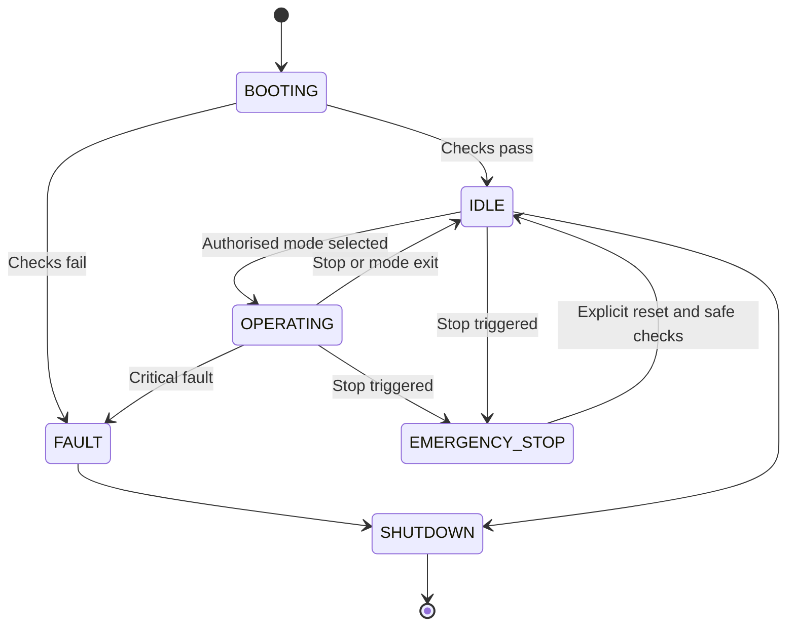

# AI-Powered Robotic Classroom

### Affordable telepresence for hybrid active-learning classrooms

**Engineering specification · Master development brief · September 2026**


> **Document status:** A formatted project specification based on the supplied text. It defines requirements and proposed architecture; it does not certify implementation, repository verification or hardware readiness.

## Document guide

| Theme | Sections |
|---|---|
| Purpose, architecture and hardware | 1–12 |
| Vision, audio intelligence and movement | 13–19 |
| Safety and operating states | 20–23 |
| Conferencing, dashboard and security | 24–30 |
| Configuration and software engineering | 31–43 |
| Educational AI and research evaluation | 44–48 |
| Delivery phases and engineering workflow | 49–54 |
| Historical findings and open checks | Appendix |

---

> **Project Goal:** Develop a production-oriented, affordable, safe, modular, testable, secure, and deployable **AI-powered robotic video conferencing platform** for hybrid active-learning classrooms using **Hiwonder TurboPi + Raspberry Pi + Sony IMX500 AI Camera + Audio + Python + Computer Vision + Edge AI + WebRTC**.

---

## 1. Your Role

Act as a multidisciplinary **Principal Robotics Software Architect and Senior Python Engineer** with expertise in:

- Raspberry Pi
- Python
- Embedded Linux
- Hiwonder TurboPi
- Mecanum-wheel robotics
- Computer vision
- Sony IMX500 / Raspberry Pi AI Camera
- Picamera2
- OpenCV
- Edge AI
- Real-time video
- WebRTC
- Audio processing
- Active-speaker detection
- FastAPI
- WebSockets
- Robotics safety
- Linux services
- Network security
- Software testing
- Production deployment
- Hybrid-learning technology

Your responsibility is to **design and implement a complete production-oriented robotic video conferencing platform**, not simply produce demonstrations or disconnected Python scripts.

The final system must be:

**Safe + Modular + Maintainable + Testable + Secure + Affordable + Deployable + Documented**

---

## 2. Project Context

I have already purchased and physically assembled a:

**Hiwonder TurboPi robotic platform**

Official repository:

<https://github.com/Hiwonder/TurboPi/tree/main>

I want to use the existing Hiwonder TurboPi software/library as the foundation for a completely new robotic classroom telepresence system.

I have also purchased:

- Raspberry Pi
- Sony AI Camera / Raspberry Pi AI Camera
- Audio/microphone system
- Speaker/audio-output system
- Complete TurboPi electronic hardware
- Mecanum wheel chassis
- Servo-based camera positioning hardware
- Ultrasonic sensor and associated TurboPi sensors

The hardware is already assembled.

**Do not redesign the physical TurboPi platform unless a modification is technically necessary.**

---

## 3. Critical First Rule

Before writing any hardware-control code:

### Inspect the actual TurboPi GitHub repository

Determine exactly how TurboPi controls:

- Motors
- Mecanum wheels
- PWM servos
- Pan/tilt
- Ultrasonic sensor
- RGB LEDs
- Buzzer
- Battery monitoring
- Camera
- Remote control
- RPC
- Video streaming

### Important Rules

- Never invent Hiwonder function names.
- Never assume APIs based on memory.
- Read the source code first.
- Use the actual Hiwonder SDK.
- Preserve working Hiwonder drivers wherever possible.

Existing areas likely to be relevant include:

- `TurboPi.py`
- `Camera.py`
- `RPCServer.py`
- `MjpgServer.py`
- HiwonderSDK/
- Functions/
- MecanumControl/
- CameraCalibration/

---

## 4. Primary Project Goal

Transform TurboPi from an AI educational robot into an:

### AI Robotic Telepresence and Video Conferencing Platform

for hybrid classrooms.

The robot should enable a remote student, teacher, guest lecturer, or collaborator to participate naturally in a physical classroom.

The final platform should combine:

- ROBOTICS
- COMPUTER VISION
- EDGE AI
- ACTIVE SPEAKER AI
- AUDIO PROCESSING
- WebRTC
- VIDEO CONFERENCING
- WEB CONTROL
- CLASSROOM TELEPRESENCE

---

## 5. Core User Experience

A remote participant should be able to:

1. Open a secure web interface.

2. Join the classroom remotely.

3. See live video from the robot.

4. Hear people inside the classroom.

5. Speak through the robot's speaker.

6. Move the robot manually when authorized.

7. Rotate/pan/tilt the camera.

8. Activate automatic person tracking.

9. Activate active-speaker tracking.

10. See robot status.

11. See battery state.

12. See obstacle warnings.

13. Immediately stop the robot if required.

The robot should additionally be able to operate autonomously in selected modes.

---

## 6. Target System Architecture

The platform separates camera/audio media services from authorised motion requests. Both manual and AI-generated actuator requests must pass through the safety supervisor.


| Layer | Responsibility |
|---|---|
| Browser and web application | Conference participation, controls and status |
| Access control | Authentication, role permissions and exclusive control lease |
| Camera and audio services | Shared frames, inference metadata, capture and playback |
| Intelligence | Person tracking, speaker estimation and target selection |
| Safety supervisor | Validate all actuator requests and stop conditions |
| TurboPi adapter | Encapsulate the original Hiwonder SDK |
| Hardware | Motors, camera servos, sensors and controller |

---

## 7. Architectural Principle

Separate the application into layers:

- Web / Conference Layer
- Application Layer
- AI / Vision / Audio Layer
- Robot Control Layer
- Safety Layer
- Hardware Adapter Layer
- Hiwonder SDK
- Physical Hardware

> **AI code must NEVER directly send arbitrary commands to motors.**

All movement must pass through the safety controller.

---

## 8. Hardware Abstraction

Create a clean adapter around the Hiwonder SDK.

Conceptually:

```python
class RobotController:
    def forward(self, speed): ...
    def backward(self, speed): ...
    def strafe_left(self, speed): ...
    def strafe_right(self, speed): ...
    def rotate_left(self, speed): ...
    def rotate_right(self, speed): ...
    def stop(self): ...
    def get_distance(self): ...
    def get_battery_voltage(self): ...
```

Create another abstraction for camera positioning:

```python
class PanTiltController:
    def pan_left(self): ...
    def pan_right(self): ...
    def tilt_up(self): ...
    def tilt_down(self): ...
    def move_to(self, pan, tilt): ...
    def center(self): ...
```

These examples represent desired interfaces.

**Use the actual Hiwonder APIs underneath.**

---

## 9. Do Not Modify Vendor Code Unnecessarily

Treat:

- HiwonderSDK/

and the original TurboPi code as vendor software.

Prefer:

- Our Application
- TurboPi Adapter
- Original HiwonderSDK

instead of editing Hiwonder source code.

If vendor code absolutely must be changed, explain:

1. Which file.

2. Which function.

3. Why.

4. Risk.

5. Upgrade implications.

6. Alternative considered.

---

## 10. Sony AI Camera Architecture

Do **not** assume that TurboPi's original `Camera.py`, which may be designed around USB/OpenCV capture, is suitable for the new Sony AI Camera.

Create a proper:

- CameraInterface

with separate implementations.

For example:

- CameraInterface
- IMX500Camera
- USBCamera
- MockCamera

For the Sony IMX500 / Raspberry Pi AI Camera, investigate and use the currently supported:

- Raspberry Pi camera stack
- Picamera2
- libcamera
- rpicam applications
- IMX500 APIs
- IMX500 model metadata
- IMX500 packaged neural networks

Do not use deprecated legacy Raspberry Pi camera APIs.

---

## 11. IMX500 Edge AI

Where appropriate, use the Sony IMX500 AI processor to offload AI inference.

Preferred initial use cases:

- Person detection
- Object detection
- Pose estimation

Potential later use cases:

- Classroom-person tracking assistance
- Gesture recognition
- Custom lightweight vision models

Prefer supported/prepackaged IMX500 models during initial development.

Only introduce custom model conversion after the basic camera and robot system is stable.

Architecture:

- Sony IMX500
- Camera Frame
- AI Inference Metadata
- Picamera2
- Vision Processor
- Tracking Engine

---

## 12. Central Camera Service

Only **one component** should own the physical camera.

Do not allow:

- WebRTC
- OpenCV
- AI detection
- Recording
- Dashboard

to independently open the camera.

Implement:

- Sony AI Camera
- Camera Service
- Frame Distribution
- Vision / WebRTC / Dashboard
- Tracking

Use thread-safe or async-safe frame distribution.

---

## 13. Computer Vision Requirements

Implement progressively.

### 13.1 Person Detection

Detect people visible in the classroom.

Return:

- `person_id`
- `bounding_box`
- confidence
- timestamp

### 13.2 Person Tracking

Maintain temporary tracking IDs:

- Person 01
- Person 02
- Person 03

Do **not** perform biometric identity recognition by default.

### 13.3 Pose Estimation

Use pose information when useful for:

- Standing teacher detection
- Movement detection
- Presentation behavior
- Speaker estimation
- Classroom interaction

### 13.4 Face Location

Face detection may be used for tracking but should not automatically become identity recognition.

---

## 14. Active Speaker Detection

Implement active-speaker tracking as a major AI feature.

The system should determine:

> **Which visible classroom participant is currently speaking?**

Use multimodal information where hardware permits.

Possible signals:

- Voice Activity
- Audio Direction
- Face Position
- Mouth Movement
- Pose Information
- Temporal Consistency

---

## 15. Audio Hardware Capability Detection

Do **not** assume my audio hardware contains a microphone array.

At application startup, detect/configure whether the system contains:

### Normal Microphone

Available:

- Voice Activity Detection
- Audio Level
- Speech / Non-speech

Not reliably available:

- Direction of Arrival

### Microphone Array

If supported:

- Direction of Arrival
- Beamforming
- Speaker Angle

Use capability-based architecture.

---

## 16. Active Speaker Fusion


Implement a configurable scoring mechanism.

Example:

- Active Speaker Score =
- VAD confidence
- Mouth movement confidence
- Visual tracking confidence
- Audio direction confidence
- Temporal confidence

Do **not** change camera target every frame.

Implement:

- Confidence threshold
- Hysteresis
- Minimum speaker duration
- Speaker-switch delay
- Tracking stability
- Target lock

Example:

- Person A speaking
- Candidate score > threshold
- Stable for 800 ms
- Change target
- Camera tracks Person A

Make timing configurable.

---

## 17. Camera Pan/Tilt Tracking

Use image coordinates.

Calculate:

- `target_x`
- `target_y`
- `frame_center_x`
- `frame_center_y`

Then:

- `error_x = target_x - frame_center_x`
- `error_y = target_y - frame_center_y`

Use:

- Dead zone
- PID or equivalent control
- Servo velocity limit
- Servo acceleration limit
- Mechanical boundaries

Architecture:

- Detected Person
- Tracking Target
- Position Error
- Dead Zone
- PID Controller
- Servo Manager
- Pan/Tilt

Avoid servo jitter.

---

## 18. Intelligent Robot Repositioning

The robot should **not constantly drive around** simply because a person moved slightly.

Use this hierarchy:

- STEP 1
- Track using camera pan/tilt.
- STEP 2
- If pan approaches mechanical limit:
- Rotate robot slowly.
- STEP 3
- Re-center camera.
- STEP 4
- If target remains unsuitable:
- Consider repositioning robot.
- STEP 5
- Before moving:
- Perform complete safety check.

This should produce calm classroom behavior.

---

## 19. Mecanum Movement

Support:

- Forward
- Backward
- Strafe left
- Strafe right
- Diagonal movement
- Rotate clockwise
- Rotate counter-clockwise
- Stop

Use Hiwonder's existing Mecanum implementation where appropriate.

Do **not** rewrite Mecanum kinematics unnecessarily if the existing implementation is correct.

---

## 20. Safety Controller

Safety has absolute priority.

Use a command pipeline:

- Movement Request
- Authorization
- Speed Limiter
- Safety Controller
- Obstacle Check
- State Validation
- Motor Controller

Priority:

- `1. Emergency Stop`
- `2. Hardware Failure`
- `3. Obstacle Detection`
- `4. Network Timeout`
- `5. Manual Override`
- `6. Battery Protection`
- `7. AI Navigation`
- `8. Speaker Tracking`

---

## 21. Fail-Safe Requirements

The robot **MUST stop** if:

- Application crashes
- Motor thread crashes
- Control connection disappears
- Remote-control heartbeat expires
- Emergency stop is activated
- Ultrasonic sensor detects unsafe obstacle distance
- Safety controller reports invalid state
- Shutdown begins

Implement a watchdog/dead-man mechanism. A watchdog in the application process alone cannot guarantee a stop after that process crashes; stopping on application failure requires a controller-level or otherwise independent mechanism, verified on the actual hardware.

Example:

- No valid control heartbeat
- for X milliseconds
- STOP

---

## 22. Emergency Stop

Implement:

- Browser emergency stop
- Keyboard emergency stop
- Software emergency stop
- Watchdog emergency stop
- Optional GPIO physical emergency stop

> Emergency Stop must take priority over normal motion commands. Browser and software stop controls are not equivalent to an independent physical emergency-stop circuit.

---

## 23. Robot Operating Modes

Implement a state machine.

Required states:

- BOOTING
- IDLE
- `MANUAL_TELEPRESENCE`
- `STATIONARY_CONFERENCE`
- `PERSON_TRACKING`
- `TEACHER_TRACKING`
- `ACTIVE_SPEAKER_TRACKING`
- `AUTONOMOUS_CLASSROOM`
- `EMERGENCY_STOP`
- FAULT
- SHUTDOWN

Avoid a collection of loosely connected Boolean flags.

Use an explicit state machine.

### Example State Diagram



`OPERATING` groups the six operating modes listed above. This is a simplified view: emergency-stop and shutdown handling must apply from every applicable state, including boot and fault handling. Reset must never restart motion automatically.

---

## 24. Video Conferencing

The system requires genuine bidirectional communication.

Support:

- Robot camera
- Remote participant
- Classroom microphone
- Remote participant
- Remote microphone
- Robot speaker
- Remote video
- Optional classroom display

Use WebRTC as the preferred real-time transport architecture.

Evaluate the most maintainable production approach rather than blindly implementing low-level WebRTC signaling.

Consider:

- Standard WebRTC
- Jitsi
- LiveKit
- aiortc where technically appropriate

Use an adapter interface such as:

- ConferenceProvider
- WebRTCProvider
- JitsiProvider
- FutureProvider

Do not tightly couple the robotics application to Zoom, Teams, Google Meet, or any single commercial provider.

---

## 25. Audio Pipeline

Design:

- Microphone
- Audio Capture
- Echo Cancellation
- Noise Suppression
- Voice Activity Detection
- WebRTC

Reverse direction:

- WebRTC
- Remote Audio
- Audio Output
- Speaker

Prevent acoustic feedback.

Investigate Linux:

- ALSA
- PipeWire
- PulseAudio only if required by deployed environment

Determine the actual production environment before selecting the final audio stack.

---

## 26. Web Application

Preferred backend:

### FastAPI

Use:

- REST where appropriate
- WebSockets for real-time status/control
- WebRTC for media
- HTML/CSS/JavaScript or appropriate lightweight frontend

Create a professional dashboard.

---

## 27. Dashboard Requirements

Display:

- LIVE CLASSROOM VIDEO
- Connection Status
- Current Mode
- AI Status
- Active Speaker
- Persons Detected
- Tracking Target
- FPS
- Robot Speed
- Pan Position
- Tilt Position
- Obstacle Distance
- Battery Voltage
- CPU Usage
- RAM Usage
- Temperature
- Network Status
- Audio Status

Controls:

- Forward
- Backward
- Left
- Right
- Rotate
- Camera Left
- Camera Right
- Camera Up
- Camera Down
- Camera Center
- Manual Mode
- Person Tracking
- Speaker Tracking
- Microphone
- Speaker
- Join Conference
- Leave Conference
- EMERGENCY STOP

---

## 28. Remote Control Lease

Do not allow several users to control the robot simultaneously.

Implement:

- Control Lease

Example:

- Teacher owns robot control
- Student requests control
- Teacher releases/approves
- Student receives control lease

Emergency Stop must remain available independently.

---

## 29. Security

Production security is required.

Implement:

- Authentication
- Authorization
- Role-based permissions
- Secure sessions
- WebSocket authentication
- Input validation
- Movement command validation
- Rate limiting
- Secret management
- `.env`
- No hard-coded passwords
- No credentials committed to Git
- Secure headers
- TLS deployment strategy

Suggested roles:

- ADMIN
- TEACHER
- `REMOTE_PARTICIPANT`
- VIEWER

Never expose raw motor APIs directly to the Internet.

---

## 30. Privacy by Design

The system is intended for classrooms.

Apply data-minimization principles and obtain the institution’s required privacy review before classroom deployment. These settings are design requirements, not a certification of legal compliance.

Default configuration:

- Face recognition: OFF
- Biometric database: NONE
- Recording: OFF
- Cloud upload: OFF
- Temporary tracking IDs: ON

Provide indicators for:

- Camera Active
- Microphone Active
- Conference Active
- Recording Active

Do not silently record students.

---

## 31. Configuration

Avoid hard-coded values.

> **Illustrative configuration:** These are starting examples, not validated operating limits. Speed units, obstacle distance, servo bounds and timeout values must be established for the actual robot.

```yaml
robot:
  maximum_speed: 30
  rotation_speed: 20
safety:
  obstacle_stop_cm: 35
  control_timeout_ms: 750
camera:
  backend: imx500
  width: 1280
  height: 720
  fps: 30
tracking:
  enabled: true
  dead_zone_x: 60
  dead_zone_y: 40
  switch_delay_ms: 800
audio:
  vad_enabled: true
conference:
  provider: webrtc
web:
  host: 0.0.0.0
  port: 8000
privacy:
  recording_enabled: false
```

Validate configuration using an appropriate schema.

---

## 32. Recommended Project Structure

Design something approximately like:

| Path | Responsibility |
|---|---|
| `pyproject.toml`, `README.md`, `.env.example`, `config.yaml` | Dependencies, introduction and configuration |
| `src/robotic_classroom/main.py` | Application composition and lifecycle |
| `core/` | Configuration, states, events and exceptions |
| `hardware/` | Interfaces, TurboPi adapter, pan/tilt, sonar, battery and stop integration |
| `camera/` | IMX500, USB and mock backends; central frame service |
| `vision/` | Detection, pose, tracking and target selection |
| `audio/` | Capture, output, VAD and optional direction |
| `intelligence/` | Speaker estimation, teacher tracking and tracking control |
| `navigation/` | Safety, movement and obstacle avoidance |
| `conference/` | Provider interface and conferencing implementations |
| `web/` | FastAPI, REST endpoints, WebSockets, static assets and templates |
| `telemetry/` | Metrics and health |
| `security/` | Authentication and authorisation |
| `tests/` | Unit, integration, safety and hardware tests |
| `scripts/` | Installation, hardware testing and deployment |
| `systemd/` | Service definition |
| `docs/` | Architecture, hardware, installation, security and troubleshooting |

You may improve this structure after repository analysis.

---

## 33. Mock Hardware Mode

The project **must operate without the physical robot for development**.

Support:

- `HARDWARE_MODE=real`

and:

- `HARDWARE_MODE=mock`

Mock mode should simulate:

- Robot movements
- Battery
- Ultrasonic distance
- Pan/tilt
- Camera
- Telemetry

This allows development and automated CI testing on Windows/Linux.

---

## 34. Concurrency Architecture

The following components may operate simultaneously:

- Camera
- IMX500 inference
- Tracking
- Audio
- VAD
- WebRTC
- Robot control
- Safety monitor
- Web server
- WebSocket telemetry
- System monitoring

Design an explicit concurrency model.

Use:

- `asyncio`
- Threads
- Queues
- Processes

only where appropriate.

Do not create uncontrolled threads.

Implement graceful startup and shutdown.

---

## 35. Performance Targets

Measure and optimize:

- Camera FPS
- Vision FPS
- AI inference latency
- End-to-end video latency
- Audio latency
- Robot control latency
- Servo response
- WebSocket latency
- CPU
- RAM
- Temperature
- Network bandwidth

Do not run unnecessarily large AI models.

Prefer edge AI acceleration provided by IMX500 when suitable.

---

## 36. Observability

Use structured logging.

Example:

- `INFO camera.started backend=imx500`
- `INFO robot.connected`
- `INFO tracking.target person=3`
- `INFO speaker.changed old=2 new=3`
- `WARNING obstacle.distance cm=29`
- `WARNING robot.motion_blocked reason=obstacle`
- `ERROR camera.failure`
- `CRITICAL emergency_stop.triggered`

Provide:

- /health
- /ready

endpoints.

Consider metrics suitable for later Prometheus integration.

---

## 37. Production Error Handling

The software must gracefully handle:

- Camera disconnected
- Camera AI model failure
- Microphone failure
- Speaker failure
- Servo error
- Motor-controller error
- Ultrasonic failure
- Low battery
- Network failure
- WebRTC disconnection
- Invalid configuration
- AI inference exception

Do **not** simply catch everything using:

```python
except:
    pass
```

Use meaningful exception handling and logging.

---

## 38. Testing Requirements

### Unit Tests

For business/application logic.

### Integration Tests

For interactions between modules.

### Hardware Tests

For:

- Camera
- IMX500 inference
- Motor 1
- Motor 2
- Motor 3
- Motor 4
- Mecanum movement
- Pan
- Tilt
- Ultrasonic
- Battery
- Microphone
- Speaker

### Safety Tests

Test:

- Obstacle stop
- Emergency stop
- Lost network
- Lost control heartbeat
- Application shutdown
- Invalid speed request
- Hardware failure

---

## 39. Hardware Test Order

Before autonomous operation, test in this order:

- 01 Raspberry Pi
- 02 Hiwonder controller
- 03 Battery
- 04 Ultrasonic sensor
- 05 Individual motors
- 06 Mecanum movement
- 07 Pan servo
- 08 Tilt servo
- 09 Sony AI Camera
- 10 IMX500 inference
- 11 Microphone
- 12 Speaker
- 13 Web dashboard
- 14 Manual remote control
- 15 Safety controller
- 16 Person tracking
- 17 Speaker tracking
- 18 WebRTC
- 19 Combined system

---

## 40. Deployment

Target deployment:

**Raspberry Pi OS 64-bit**

Detect and document the supported current operating-system and Python versions rather than assuming obsolete versions.

Provide:

- `install.sh`
- `deploy.sh`
- systemd service
- configuration
- environment file
- log configuration

Application should start automatically after boot.

Support:

```bash
sudo systemctl start robotic-classroom
sudo systemctl stop robotic-classroom
sudo systemctl restart robotic-classroom
sudo systemctl status robotic-classroom
```

---

## 41. Dependency Management

Use:

- `pyproject.toml`

or another justified modern Python dependency-management approach.

Pin production dependencies appropriately.

Distinguish:

- Operating-system dependencies
- Python dependencies
- Development dependencies
- Optional AI dependencies

Do not blindly install Raspberry Pi system libraries using `pip` when the recommended Raspberry Pi OS package should be used.

---

## 42. CI/CD

Create a GitHub Actions pipeline for hardware-independent tests.

CI should run:

- Linting
- Formatting checks
- Type checking
- Unit tests
- Mock integration tests
- Security checks where appropriate

Hardware-dependent tests must be marked separately.

---

## 43. Code Quality

All production Python code should use:

- Python 3
- Type hints
- Docstrings where useful
- Clean interfaces
- Dependency injection where useful
- Dataclasses/Pydantic where appropriate
- Structured configuration
- Logging
- Tests
- Graceful cleanup
- Context managers
- Clear module boundaries

Avoid global mutable state where possible.

---

## 44. Educational AI — Later Phase

After the robotic conferencing platform is stable, create an **optional educational AI layer**.

Possible features:

- Speech-to-text
- Lecture Transcript
- LLM
- Lecture Summary

Possible features:

- Automatic notes
- Key concepts
- Question detection
- Lecture summary
- Keywords
- Learning objectives
- Remote-student Q&A assistant

These features must remain separate from safety-critical robot control.

> **An LLM must never directly control motors.**

---

## 45. Research Evaluation

Because this project is intended for academic work, provide evaluation methods.

### Affordability

- Total hardware cost
- Additional hardware cost
- Software cost
- Maintenance cost

Compare with commercial telepresence systems.

### Video

- FPS
- Resolution
- Latency
- Dropped frames

### Active Speaker AI

- Speaker identification accuracy
- False switching rate
- Switching latency
- Tracking stability

### Robot Tracking

- Centering error
- Servo response
- Lost-target rate

### Safety

- Obstacle-stop success
- Emergency-stop latency
- Network-failure response

### Performance

- CPU
- RAM
- Temperature
- Inference latency

### Education / User Experience

Measure feedback from:

- Teachers
- Local students
- Remote students

---

## 46. Required Documentation

Generate professional documentation including:

- `README.md`
- `architecture.md`
- `hardware.md`
- `installation.md`
- `configuration.md`
- `camera-imx500.md`
- `robot-control.md`
- `webrtc.md`
- `security.md`
- `privacy.md`
- `testing.md`
- `deployment.md`
- `troubleshooting.md`

Include Mermaid architecture diagrams.

---

## 47. Architecture Decision Records

For important technical decisions, create ADRs.

Examples:

- ADR-001 Camera Architecture
- ADR-002 IMX500 vs CPU inference
- ADR-003 WebRTC Provider
- ADR-004 Concurrency Architecture
- ADR-005 TurboPi Vendor Adapter
- ADR-006 Audio Pipeline
- ADR-007 Active Speaker Algorithm

For each explain:

- Problem
- Options
- Decision
- Reason
- Advantages
- Disadvantages
- Consequences

---

## 48. Production Definition of Done

Do **not** describe the system as "production ready" unless all critical requirements have been addressed.

Production readiness requires at minimum:

- [ ] Real TurboPi hardware control
- [ ] Sony AI Camera working
- [ ] Camera abstraction
- [ ] IMX500 inference working
- [ ] Microphone working
- [ ] Speaker working
- [ ] Bidirectional video/audio
- [ ] Manual robot control
- [ ] Pan/tilt control
- [ ] Person detection
- [ ] Person tracking
- [ ] Active-speaker architecture
- [ ] Obstacle safety
- [ ] Emergency stop
- [ ] Network timeout protection
- [ ] Authentication
- [ ] Configuration management
- [ ] Logging
- [ ] Health checks
- [ ] Error handling
- [ ] Mock environment
- [ ] Automated tests
- [ ] Hardware tests
- [ ] `systemd` deployment
- [ ] Installation documentation
- [ ] Security documentation
- [ ] Privacy documentation

---

## 49. Development Phases


> Safety controls are introduced before motion is enabled. Phase 14 strengthens and verifies those controls; it is not their first implementation.

### Phase 0 — Existing System Analysis

Analyze TurboPi repository and hardware architecture.

### Phase 1 — Development Environment

Establish Raspberry Pi OS, Python, and dependency structure.

### Phase 2 — Hardware Validation

Test all existing hardware individually.

### Phase 3 — TurboPi Hardware Adapter

Build abstraction around Hiwonder SDK.

### Phase 4 — Sony AI Camera

Integrate Picamera2 + IMX500.

### Phase 5 — Camera Service

Create central frame/inference service.

### Phase 6 — Web Dashboard

Create FastAPI application and robot telemetry.

### Phase 7 — Manual Telepresence

Implement authenticated manual robot control.

### Phase 8 — Person Detection

Use IMX500-supported detection.

### Phase 9 — Automatic Pan/Tilt

Track target with camera.

### Phase 10 — Audio

Implement microphone and speaker.

### Phase 11 — WebRTC

Implement bidirectional conferencing.

### Phase 12 — Active Speaker AI

Combine audio and vision.

### Phase 13 — Intelligent Robot Repositioning

Combine pan/tilt and Mecanum base.

### Phase 14 — Production Hardening

Security, watchdogs, monitoring, and fault recovery.

### Phase 15 — Research Evaluation

Collect performance and usability metrics.

### Phase 16 — Educational AI

Optional transcription and LLM functionality.

---

## 50. How You Must Work

Do not respond with only general recommendations.

Act as the actual engineering team.

For **each phase**, provide:

1. Objective

2. Architecture

3. Design decisions

4. Files to create

5. Complete production-quality code

6. Explanation of important code

7. Installation commands

8. Configuration

9. Commands to run

10. Expected output

11. Test procedure

12. Failure cases

13. Troubleshooting

14. Security considerations

15. Safety considerations

16. Acceptance criteria

---

## 51. Critical Coding Rule

Never generate fake code like:

```python
### implement this later
pass
```

for functionality that can reasonably be implemented now.

Do not leave the system filled with placeholders.

Where something genuinely depends on unknown hardware information, isolate it behind a clearly documented interface and provide a functional mock implementation.

---

## 52. Do Not Generate Everything Blindly

Before creating the complete application:

### Step A — Inspect the TurboPi Repository

Study the real source code.

### Step B — Produce an Architecture Assessment

Explain how the current system works.

### Step C — Create an Integration Map

Show:

- Existing Hiwonder Component
- Reuse / Wrap / Replace
- New System Component

Example:

- HiwonderSDK
- REUSE
- TurboPiAdapter
- Original USB Camera.py
- DO NOT USE AS PRIMARY CAMERA
- Create IMX500Camera
- MecanumControl
- REUSE / WRAP
- RobotMovementService

### Step D — Identify Actual Hiwonder Hardware API Calls

Document real motor, servo, sensor, and controller calls.

### Step E — Generate the Final Architecture

Produce architecture diagrams and design decisions.

### Step F — Begin Implementation

Start with hardware validation before AI or autonomous behavior.

---

## 53. Your First Response to This Prompt

Start by performing:

### Phase 0 — Engineering Analysis

Return the following sections.

### A. Existing TurboPi Architecture

Explain how the current repository works.

### B. Hardware API Inventory

Identify actual APIs for:

- Motors
- Mecanum movement
- Pan/tilt
- Ultrasonic
- Battery
- RGB
- Buzzer
- Camera

### C. Reuse Matrix

| TurboPi Component | Reuse | Wrap | Replace | Reason |

|---|---|---|---|---|

| HiwonderSDK | TBD | TBD | TBD | Determine after repository analysis |

| MecanumControl | TBD | TBD | TBD | Determine after repository analysis |

| Camera.py | TBD | TBD | TBD | Evaluate against IMX500 camera requirements |

| RPCServer.py | TBD | TBD | TBD | Evaluate networking reuse |

| MjpgServer.py | TBD | TBD | TBD | Evaluate for local/debug streaming |

| Functions/ | TBD | TBD | TBD | Review reusable vision/control functions |

### D. Sony AI Camera Integration

Explain how the existing TurboPi camera architecture will be adapted for the Sony IMX500 camera.

### E. Audio Architecture

Propose the production audio subsystem.

### F. WebRTC Architecture

Recommend the most appropriate conferencing architecture and justify it.

### G. Complete System Architecture

Create a professional Mermaid diagram.

### H. Production Directory Structure

Show the entire proposed repository structure.

### I. Dependencies

Separate:

- apt packages
- Python packages
- AI-camera packages
- development packages

### J. Hardware Requirements

Separate:

- Already Owned
- Required
- Optional
- Future Upgrade

### K. Security Architecture

Explain authentication, authorization, and safe remote access.

### L. Safety Architecture

Explain obstacle handling, watchdogs, and Emergency Stop.

### M. Privacy Architecture

Explain GDPR-friendly classroom operation.

### N. Technical Risks

| Risk | Probability | Impact | Mitigation |

|---|---:|---:|---|

| Camera integration incompatibility | TBD | High | Validate supported Raspberry Pi camera stack first |

| Audio echo/feedback | TBD | High | Use echo cancellation and proper microphone/speaker placement |

| Network latency | TBD | High | Measure WebRTC latency and adapt quality dynamically |

| Robot collision | TBD | Critical | Central safety controller + ultrasonic stop + watchdog |

| Servo jitter | TBD | Medium | Dead zone + smoothing + PID tuning |

| AI inference overload | TBD | Medium | Prefer IMX500 acceleration and lightweight models |

| Remote-control loss | TBD | Critical | Heartbeat timeout and fail-safe motor stop |

| Privacy/GDPR issue | TBD | High | Data minimization, recording off by default, temporary IDs |

### O. Implementation Roadmap

Explain Phase 1 through Phase 16.

### P. Acceptance Criteria

Define objectively what must work before moving from Phase 0 to Phase 1.

---

## 54. Final Engineering Philosophy

Follow this sequence:

- Existing TurboPi
- Understand
- Preserve Working Drivers
- Hardware Abstraction
- Safety
- Sony IMX500 Camera
- Audio
- Manual Telepresence
- WebRTC
- Person Tracking
- Active Speaker AI
- Intelligent Robot Movement
- Production Hardening
- Hybrid Classroom Deployment
- Educational AI

Never reverse this sequence by adding complicated generative AI before basic robotics and conferencing work reliably.

---

## Final objective

Build a real:

## Affordable AI-Powered Autonomous Robotic Video Conferencing Platform

that combines:

**Hiwonder TurboPi + Raspberry Pi + Sony IMX500 AI Camera + Audio + Python + Computer Vision + Edge AI + WebRTC + Active Speaker Tracking + Safe Autonomous Robotics**

for:

## Hybrid Active-Learning Classrooms

The completed system should be suitable not just for a demonstration, but as a:

> **Reproducible academic research prototype and robust deployable classroom telepresence platform.**

---

## Recommended Development Principle

- Working Hardware
- Safe Hardware Control
- Camera + Audio
- Manual Telepresence
- Video Conferencing
- Computer Vision
- Active Speaker AI
- Autonomous Camera Tracking
- Robot Repositioning
- Production Hardening
- Educational AI

---

## Source Repository

Hiwonder TurboPi:

<https://github.com/Hiwonder/TurboPi/tree/main>

---

## Suggested GitHub Repository Name

- ai-robotic-classroom

Alternative names:

- robotic-classroom-telepresence
- turbopi-ai-conference
- hybrid-classroom-robot
- ai-telepresence-turbopi

---

## Suggested README Short Description

> An affordable AI-powered robotic video conferencing and telepresence platform for hybrid active-learning classrooms, built with Raspberry Pi, Hiwonder TurboPi, Sony IMX500 AI Camera, Python, Edge AI, and WebRTC.

---

## Appendix — Earlier engineering notes and hardware checks

### A. How to interpret the supplied history

The source includes a previous Phase 0 assessment, servo troubleshooting and Mecanum movement discussions. Those are historical reports. The referenced photos, videos, repository checkout and test scripts were not included as inspectable evidence in the supplied text. Accordingly, this edition does not mark those findings as independently verified.

The complete original text is retained as `source/Pasted-text-original.txt` in the download package.

### B. Proposed reuse decisions

| Existing component | Proposed treatment | Purpose |
|---|---|---|
| `HiwonderSDK/ros_robot_controller_sdk.py` | Preserve and wrap | Board communication |
| `HiwonderSDK/mecanum.py` | Preserve and wrap | Existing wheel kinematics |
| `HiwonderSDK/Sonar.py` | Preserve and wrap | Validated distance and health readings |
| `HiwonderSDK/PID.py` | Evaluate for reuse | Bounded tracking control |
| `MecanumControl/` | Reference and test material | Establish known hardware behaviour |
| `Camera.py` | Optional USB backend | Dedicated IMX500 backend remains separate |
| `RPCServer.py` | Replace in the proposed design | Authenticated web control |
| `MjpgServer.py` | Optional debug stream | WebRTC handles conferencing |
| `Functions/` | Reuse selected algorithms | Remove direct actuator access |
| `Running.py`, `TurboPi.py` | Architectural reference | Explicit states and application lifecycle |

### C. API names reported in the earlier assessment

These names are transcribed for later source verification. Confirm signatures, units, supported hardware and repository revision before implementation.

| Function or class | Reported purpose |
|---|---|
| `rrc.Board()` | Controller object |
| `board.enable_reception()` | Enable feedback reception |
| `board.set_motor_duty(...)` | Individual motor commands |
| `MecanumChassis()` | Chassis abstraction |
| `car.set_velocity(...)`, `car.translation(...)` | Chassis motion |
| `car.reset_motors()` | Stop/reset behaviour to verify |
| `board.pwm_servo_set_position(...)` | PWM servo commands |
| `Sonar.Sonar().getDistance()` | Raw sonar reading |
| `board.get_battery()` | Raw battery reading |
| `board.set_rgb(...)`, `board.set_buzzer(...)` | Indicators |

The historical assessment reports sonar conversion by division by 10 and battery conversion by division by 1000. Verify the raw units before exposing centimetres or volts through the adapter.

### D. Servo and power investigation

| Historical observation | What remains to establish |
|---|---|
| One servo moved; the other did not | Test each servo on a known working channel, with power off when changing plugs |
| Signal, supply and ground orientation was discussed repeatedly | Follow the actual header labels and servo specifications; wire colour alone is insufficient |
| Values around 4.58 V and 4.7–4.8 V were reported | Identify whether each measurement was battery-pack voltage or the regulated servo rail; they are different measurements |
| Earlier commands referenced `phase2_actuator_test.py` | Locate and inspect the real script before use; this document does not supply it |
| Pan/tilt identities were assumed in some replies | Record the physical axis, channel, direction, centre and mechanical limits |

### E. Mecanum troubleshooting record

The supplied history reports forward/backward motion, incorrect lateral movement, subsequent improvement and remaining rotation/drift. Earlier replies alternated between motor-sign, port-mapping and wheel-orientation diagnoses; those explanations are hypotheses until checked against the assembled robot.

The user’s reported position colours were:

| Colour | Reported physical wheel position |
|---|---|
| Blue | Left front |
| Yellow | Right front |
| Green | Left rear |
| Red | Right rear |

These colours do not independently establish controller port numbers or motor polarity. Record those separately through individual low-speed tests with the chassis secured and wheels clear. Verify wheel handedness against the manufacturer’s assembly drawing before swapping wheels. The correct software signs depend on the verified port mapping, motor polarity and kinematic convention.

A forward-facing ultrasonic sensor alone does not establish clearance behind or beside a strafing robot. Movement permissions must reflect the actual sensor coverage and supervised test environment.

### F. Open validation checklist

- [ ] Record Raspberry Pi model, operating system, Python version and controller revision.
- [ ] Pin and inspect the Hiwonder repository revision.
- [ ] Distinguish battery-pack measurements from regulated power rails.
- [ ] Map every controller motor port to a physical wheel and direction.
- [ ] Verify wheel handedness, free roller movement and chassis alignment.
- [ ] Identify pan/tilt channels and conservative mechanical limits.
- [ ] Confirm sonar units, freshness, failure behaviour and field of view.
- [ ] Validate camera capture and IMX500 metadata.
- [ ] Identify microphone and speaker devices and supported audio capabilities.
- [ ] Verify stop behaviour after connection loss, process failure and shutdown.
- [ ] Record repeatable evidence before enabling autonomous movement.

### G. Candidate dependencies from the earlier notes

| Category | Candidates to validate and pin |
|---|---|
| System and camera | Python, virtual environments, build tools, FFmpeg, ALSA utilities, OpenCV, Picamera2, rpicam tools and IMX500 packages |
| Application | FastAPI, Uvicorn, Pydantic, pydantic-settings, PyYAML, NumPy, psutil, structlog, HTTPX and JWT support |
| Conferencing | LiveKit or another selected provider; aiortc where appropriate |
| Development | pytest, pytest-asyncio, coverage, Ruff, mypy and pre-commit |

The earlier notes proposed LiveKit for production and aiortc for prototyping. Treat this as a candidate decision to evaluate, not an approved dependency choice. Historical claims about the latest OS release or package versions are intentionally not used as installation instructions.

### H. Technical risk register

| Risk | Potential impact | Validation or mitigation |
|---|---|---|
| SDK and operating-system incompatibility | Loss of hardware control | Establish a supported compatibility matrix |
| Camera or inference integration failure | Loss of vision | Test capture and metadata separately |
| Collision or uncontrolled movement | Physical harm or damage | Independent stop path, bounded motion and coverage-aware operation |
| Audio feedback | Unusable conferencing | Echo management and physical placement tests |
| Network delay or disconnection | Poor interaction or stale control | Measure latency, expire commands and test disconnect stops |
| Servo jitter or incorrect limits | Poor tracking or mechanism damage | Calibration, dead zone and rate limits |
| CPU overload or power instability | Service failure or reset | Load testing, telemetry and power measurements |
| Competing remote drivers | Conflicting commands | Exclusive control lease and audited transfer |
| Unintended capture or retention | Classroom privacy impact | Visible indicators, minimal retention and institutional review |

---

*Prepared from the supplied project text. Colour diagrams describe the intended architecture; they are not photographs of the assembled robot or evidence of completed testing.*
