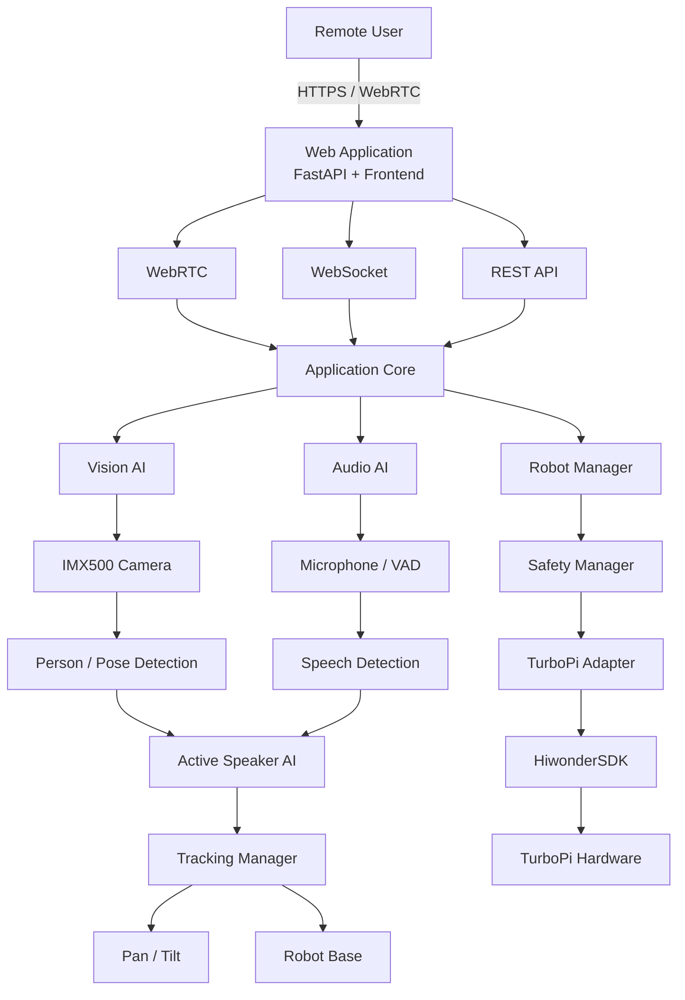
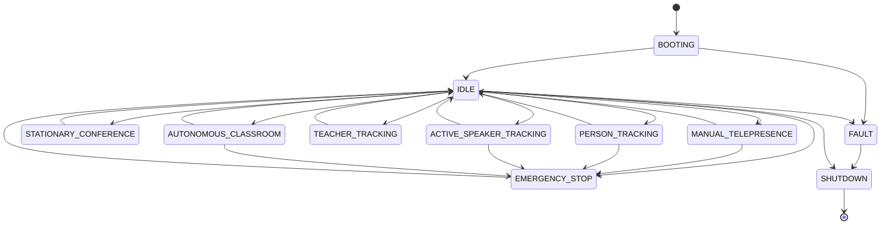

Wed, Sep 2 at 11:44 PM
Pasted markdown(3).md
File
@
GitHub
 
Phase 0 — Engineering Analysis Complete

I inspected the actual connected Hiwonder/TurboPi GitHub repository rather than assuming its APIs. Your master prompt specifically requires this repository-first approach before hardware code is generated.

The conclusion is strong: we should preserve the Hiwonder hardware drivers, wrap them behind our own interfaces, replace the old USB-camera/network architecture, and put one centralized safety controller between every AI/web command and the motors.

A. Existing TurboPi Architecture

The official repository identifies TurboPi as a Raspberry Pi 4B/5B Mecanum robot using a USB camera, OpenCV/MediaPipe vision, JSON-RPC remote control, MJPEG streaming, PWM servos, motors, ultrasonic sensing, RGB and buzzer hardware.

The current execution model is approximately:

TurboPi.py
    │
    ├── rrc.Board()
    │      └── Hiwonder controller
    │
    ├── Sonar.Sonar()
    │
    ├── Battery monitoring thread
    │
    ├── RPCServer thread
    │
    ├── MjpgServer thread
    │
    ├── Camera.Camera()
    │
    └── Main processing loop
            │
            └── Functions/Running.py
                    │
                    ├── RemoteControl
                    ├── ColorDetect
                    ├── ColorTracking
                    ├── VisualPatrol
                    ├── QuickMark
                    └── Avoidance

TurboPi.py creates a single Board, calls enable_reception(), instantiates the sonar, starts battery monitoring, RPC and MJPEG threads, creates the camera, and then processes the currently selected vision function in its main loop.

This is acceptable for an educational robot, but the new platform needs stronger separation of concerns.

Main weaknesses for our new system

The current architecture relies heavily on:

module-level global state;
daemon threads;
direct hardware access from vision modules;
direct RPC-to-motor operations;
unauthenticated-style JSON-RPC architecture;
a single global img_show variable for streaming;
USB/OpenCV camera capture;
AI algorithms that can directly move the chassis.

For example, current face tracking calculates PID outputs and directly calls:

car.translation(dx, dy)

while controlling pan/tilt through:

board.pwm_servo_set_position(...)

That direct Vision → Motors relationship will not exist in our production architecture.

B. Verified Hardware API Inventory

These are real APIs found in the repository.

Hardware	Verified TurboPi API
Controller	rrc.Board()
Receive enable	board.enable_reception()
Individual motors	board.set_motor_duty(...)
Mecanum chassis	MecanumChassis()
Omnidirectional movement	car.set_velocity(...)
X/Y translation	car.translation(x, y)
Stop/reset	car.reset_motors() / velocity zero
PWM servo	board.pwm_servo_set_position(...)
Battery	board.get_battery()
Ultrasonic	Sonar.Sonar().getDistance()
RGB	board.set_rgb(...)
Buzzer	board.set_buzzer(...)
USB camera	Camera.Camera()
Camera frame	camera.frame
JSON RPC	RPCServer.py
MJPEG video	MjpgServer.py
Motors

The actual low-level call is:

board.set_motor_duty([
    [1, duty1],
    [2, duty2],
    [3, duty3],
    [4, duty4],
])

The Mecanum controller calculates individual wheel velocities and forwards them through set_motor_duty().

The SDK itself implements:

def set_motor_duty(self, dutys):
Mecanum movement

Verified:

car = MecanumChassis()

car.set_velocity(
    velocity,
    direction,
    angular_rate
)

car.translation(
    velocity_x,
    velocity_y
)

This code should be reused and wrapped, not rewritten.

Pan/Tilt servos

Verified API:

board.pwm_servo_set_position(
    duration,
    [
        [servo_id, pulse],
        ...
    ]
)

Existing face tracking controls servo IDs 1 and 2. However, our hardware-validation phase must verify which physical axis corresponds to each ID before we standardize pan and tilt.

Ultrasonic

Actual API:

HWSONAR = Sonar.Sonar()
distance = HWSONAR.getDistance()

The existing avoidance application converts the reading with:

dist = HWSONAR.getDistance() / 10.0

and treats the resulting value as centimetres.

We should isolate that conversion inside:

UltrasonicSensor

so the rest of the system only sees validated SI/domain units.

Battery

Actual API:

board.get_battery()

The existing TurboPi program divides the result by 1000.0 before displaying voltage.

Our adapter should therefore expose something such as:

battery.voltage_v

rather than exposing the vendor-specific raw value.

RGB

Actual API:

board.set_rgb([
    [1, r, g, b],
    [2, r, g, b],
])
Buzzer

Actual API:

board.set_buzzer(
    frequency,
    on_time,
    off_time,
    repeat
)
C. Reuse Matrix
TurboPi Component	Reuse	Wrap	Replace	Decision
HiwonderSDK/ros_robot_controller_sdk.py	✅	✅	❌	Preserve vendor hardware protocol
HiwonderSDK/mecanum.py	✅	✅	❌	Existing kinematics already work
HiwonderSDK/Sonar.py	✅	✅	❌	Wrap distance/health semantics
HiwonderSDK/PID.py	✅ possible	✅	optional	Useful reference for pan/tilt
MecanumControl/	Reference	—	—	Demo/test programs, not production services
Camera.py	fallback	✅	✅ primary	Keep only for USB-camera compatibility
RPCServer.py	concepts only	❌	✅	Replace with authenticated FastAPI/WebSocket
MjpgServer.py	debug only	optional	✅	WebRTC for production media
Functions/Avoidance.py	algorithm reference	✅ concepts	✅ architecture	Safety must be centralized
Functions/FaceTracking.py	algorithm reference	✅ concepts	✅ architecture	Must not directly move motors
Other Functions/	selective	selective	selective	Educational algorithms can be reused
Running.py	concept	❌	✅	Replace Boolean/function model with state machine
TurboPi.py	reference	❌	✅	New application composition root

MecanumControl/ contains demonstrations for forward motion, turning, movement, slant/diagonal movement and drifting.

D. Sony IMX500 AI Camera Integration

This is one of the largest architectural changes.

Current Camera.py is explicitly based on:

cv2.VideoCapture(-1)

with its own capture thread.

Therefore:

Current TurboPi Camera.py
        │
        ▼
USB / OpenCV backend
        │
        ├──────────────► preserve as USBCamera
        │
        X
Do not use as IMX500 backend

New design:

                  CameraInterface
                        │
          ┌─────────────┼─────────────┐
          │             │             │
          ▼             ▼             ▼
   IMX500Camera     USBCamera      MockCamera
          │
          ▼
      CameraService
          │
    FrameDistributor
    ┌─────┼──────┐
    ▼     ▼      ▼
 Vision WebRTC Dashboard

Current Raspberry Pi documentation confirms that the AI Camera uses the Sony IMX500, integrates with libcamera, rpicam-apps, and Picamera2, and supports inference metadata directly from the sensor.

The IMX500 installation currently uses:

sudo apt update
sudo apt full-upgrade
sudo apt install imx500-all

and Picamera2 can access the accelerator through:

from picamera2.devices.imx500 import IMX500

The legacy Raspberry Pi camera stack should not be used; Raspberry Pi explicitly describes it as unsupported for newer cameras.

Initial IMX500 AI functions

Start with:

Person Detection
       ↓
Bounding Boxes
       ↓
Temporary Tracking IDs
       ↓
Pan/Tilt Target Selection

Then:

Pose Estimation
       +
Face location
       +
Audio VAD
       ↓
Active Speaker Estimation

Do not begin with custom IMX500 model conversion.

E. Audio Architecture

I recommend:

Microphone
    │
    ▼
Audio Device Adapter
    │
    ├── Capability Detection
    │
    ├── Level Monitoring
    │
    ├── VAD
    │
    └── Optional DOA
    │
    ▼
WebRTC Audio Pipeline
    │
    ├── Echo Cancellation
    ├── Noise Suppression
    └── Gain Management

Reverse:

Remote Participant
      ↓
WebRTC
      ↓
Audio Output Service
      ↓
Robot Speaker

We must first detect whether your purchased audio hardware is:

Normal microphone

or:

Microphone array

A normal microphone gives us useful VAD but not reliable speaker direction.

That distinction is important for active-speaker AI.

F. WebRTC Architecture

For the production architecture I recommend:

LiveKit as primary production provider

with:

aiortc as development/prototyping provider

Architecture:

ConferenceProvider
        │
        ├── LiveKitProvider     ← production
        │
        ├── AiortcProvider      ← development/testing
        │
        └── MockProvider

LiveKit provides a WebRTC transport/SFU architecture, browser/device SDKs, TURN support and self-hosting. Its documentation supports self-hosted deployments for control over infrastructure and data location.

aiortc remains extremely useful because it exposes WebRTC directly to Python and integrates naturally with OpenCV/video processing.

Important separation

Media transport:

LiveKit/WebRTC

must remain separate from:

Robot Safety + Motor Control

A failed conference must never leave the robot moving.

G. Complete Proposed Architecture
H. Production Repository Structure
ai-robotic-classroom/
│
├── README.md
├── pyproject.toml
├── .env.example
├── .gitignore
├── config.yaml
│
├── src/
│   └── robotic_classroom/
│       │
│       ├── main.py
│       │
│       ├── core/
│       │   ├── config.py
│       │   ├── state_machine.py
│       │   ├── events.py
│       │   └── exceptions.py
│       │
│       ├── vendor/
│       │   └── hiwonder/
│       │
│       ├── hardware/
│       │   ├── interfaces.py
│       │   ├── turbopi_adapter.py
│       │   ├── motor_controller.py
│       │   ├── pan_tilt.py
│       │   ├── ultrasonic.py
│       │   ├── battery.py
│       │   ├── rgb.py
│       │   └── buzzer.py
│       │
│       ├── safety/
│       │   ├── supervisor.py
│       │   ├── watchdog.py
│       │   ├── emergency_stop.py
│       │   └── command_validator.py
│       │
│       ├── camera/
│       │   ├── interface.py
│       │   ├── service.py
│       │   ├── imx500.py
│       │   ├── usb.py
│       │   └── mock.py
│       │
│       ├── vision/
│       │   ├── person_detector.py
│       │   ├── tracker.py
│       │   ├── pose.py
│       │   └── target_selector.py
│       │
│       ├── audio/
│       │   ├── devices.py
│       │   ├── capture.py
│       │   ├── playback.py
│       │   └── vad.py
│       │
│       ├── intelligence/
│       │   ├── active_speaker.py
│       │   └── tracking_controller.py
│       │
│       ├── conference/
│       │   ├── interface.py
│       │   ├── livekit.py
│       │   ├── aiortc.py
│       │   └── mock.py
│       │
│       ├── web/
│       │   ├── app.py
│       │   ├── api/
│       │   ├── websocket/
│       │   ├── static/
│       │   └── templates/
│       │
│       ├── security/
│       │   ├── authentication.py
│       │   ├── authorization.py
│       │   └── control_lease.py
│       │
│       └── telemetry/
│           ├── metrics.py
│           ├── health.py
│           └── logging.py
│
├── tests/
│   ├── unit/
│   ├── integration/
│   ├── safety/
│   └── hardware/
│
├── scripts/
│   ├── install.sh
│   ├── hardware_test.sh
│   └── deploy.sh
│
├── systemd/
│   └── robotic-classroom.service
│
└── docs/
    ├── architecture.md
    ├── hardware.md
    ├── imx500.md
    ├── audio.md
    ├── webrtc.md
    ├── safety.md
    ├── security.md
    ├── privacy.md
    └── troubleshooting.md
I. Dependencies

As of September 2026, the current Raspberry Pi OS 64-bit image is based on Debian 13 Trixie; Raspberry Pi lists the June 18, 2026 image with kernel 6.18.

That should be our candidate production OS.

However, we must first test the Hiwonder controller SDK on Trixie before committing to it. The robot hardware is more important than blindly choosing the newest OS.

OS packages

Initial baseline:

python3
python3-venv
python3-dev
git
build-essential
ffmpeg
alsa-utils
python3-opencv
python3-picamera2
python3-munkres
rpicam-apps
imx500-all

Raspberry Pi currently recommends installing Picamera2 through apt, not through pip, when using Raspberry Pi OS.

Python application packages

Likely baseline:

fastapi
uvicorn
pydantic
pydantic-settings
PyYAML
numpy
psutil
structlog
httpx
PyJWT

Conference-specific packages will be pinned only after the Phase 1 compatibility tests:

LiveKit Python SDK
aiortc
Development
pytest
pytest-asyncio
pytest-cov
ruff
mypy
pre-commit
J. Hardware Requirements

Your prompt confirms you already own the TurboPi platform, Raspberry Pi, Sony AI Camera, audio input/output, Mecanum chassis, servos and ultrasonic hardware.

Already owned
Hiwonder TurboPi
Raspberry Pi
Sony IMX500 AI Camera
Mecanum chassis
4 motors
Pan/tilt servos
Ultrasonic sensor
Microphone/audio system
Speaker system
Controller electronics
Required
Correct Raspberry Pi AI Camera ribbon cable
Reliable Raspberry Pi power
Reliable robot battery
Network connectivity
microSD/SSD
Verified microphone input
Verified speaker output
Strongly recommended
Physical Emergency Stop
Optional
Microphone array
Ethernet connection
Classroom display
External status LED
Physical conference/mic indicator
K. Security Architecture

The old JSON-RPC system should never be exposed directly to the Internet.

Production path:

Internet
   ↓
TLS
   ↓
Authenticated FastAPI
   ↓
Role Authorization
   ↓
Control Lease
   ↓
Command Validation
   ↓
Safety Controller
   ↓
TurboPi Adapter

Roles:

ADMIN
TEACHER
REMOTE_PARTICIPANT
VIEWER

Movement additionally requires:

authentication
+
movement permission
+
valid control lease
+
fresh heartbeat
+
safe robot state

Use short-lived conference tokens separately from robot-control authorization.

L. Safety Architecture

This is the highest-priority redesign.

The existing TurboPi heartbeat gives a selected application function approximately 15 seconds before it is unloaded.

Fifteen seconds is far too long for a motor dead-man timer.

Our motor heartbeat should initially be approximately:

500–750 ms

and configurable after hardware testing.

Safety pipeline:

Motion Request
      ↓
Authentication
      ↓
Control Lease
      ↓
Command Validation
      ↓
Speed Limit
      ↓
State Machine
      ↓
Sensor Freshness
      ↓
Obstacle Check
      ↓
Battery Check
      ↓
Safety Supervisor
      ↓
TurboPi Adapter
      ↓
Motors

Safety priority:

1 Emergency Stop
2 Hardware Fault
3 Obstacle
4 Lost heartbeat/network
5 Invalid state
6 Manual control
7 Battery protection
8 Autonomous movement
9 Speaker tracking

Most importantly:

AI
 ↓
Movement REQUEST
 ↓
Safety Controller
 ↓
Motor

Never:

AI
 ↓
Motor
M. Privacy Architecture

Default classroom configuration:

privacy:
  face_recognition: false
  biometric_database: false
  recording: false
  cloud_upload: false
  persistent_person_ids: false

Use:

Person-01
Person-02
Person-03

for temporary session tracking.

Prefer IMX500/on-device processing wherever practical.

Visible indicators should show:

CAMERA ACTIVE
MICROPHONE ACTIVE
CONFERENCE ACTIVE
RECORDING ACTIVE

Recording must be an explicit, separately controlled feature.

N. Technical Risks
Risk	Probability	Impact	Mitigation
Hiwonder SDK incompatibility with current Trixie OS	Medium	High	Hardware compatibility test before migration
IMX500 integration issue	Medium	High	Test rpicam-hello → IMX500 demo → Picamera2 first
Servo calibration incorrect	Medium	High	Record actual center/min/max values
Robot collision	Medium	Critical	Central safety controller
Lost remote connection	Medium	Critical	<1 s dead-man watchdog
Audio echo	High	High	AEC + microphone/speaker placement
Network latency	Medium	High	WebRTC + adaptive bitrate
TURN/firewall issues	Medium	High	Test LAN, NAT and external networks
Servo jitter	Medium	Medium	Dead zone + smoothing + PID
IMX500/vision latency	Low–Medium	Medium	Accelerator + frame-rate limits
Raspberry Pi CPU overload	Medium	Medium	Keep inference on IMX500
Battery brownout	Medium	High	Monitor voltage and test under motor load
Multiple remote drivers	Medium	Critical	Exclusive control lease
Privacy/GDPR problems	Medium	High	Data minimization and local processing
O. Implementation Roadmap

Your requested sequence is correct.

PHASE 0
Repository + engineering analysis
        ↓
PHASE 1
Raspberry Pi environment
        ↓
PHASE 2
Hardware validation
        ↓
PHASE 3
TurboPi hardware adapter
        ↓
PHASE 4
Sony IMX500
        ↓
PHASE 5
Central camera service
        ↓
PHASE 6
FastAPI dashboard
        ↓
PHASE 7
Authenticated manual telepresence
        ↓
PHASE 8
Person detection
        ↓
PHASE 9
Automatic pan/tilt
        ↓
PHASE 10
Audio
        ↓
PHASE 11
WebRTC / LiveKit
        ↓
PHASE 12
Active-speaker AI
        ↓
PHASE 13
Safe robot repositioning
        ↓
PHASE 14
Production hardening
        ↓
PHASE 15
Academic evaluation
        ↓
PHASE 16
Optional educational LLM layer

The LLM is deliberately last.

P. Phase 0 Acceptance Criteria
Repository-analysis criteria — ✅ completed

We now know:

✅ actual repository structure;
✅ actual motor API;
✅ actual Mecanum implementation;
✅ actual servo API;
✅ actual sonar API;
✅ actual battery API;
✅ actual RGB API;
✅ actual buzzer API;
✅ existing camera architecture;
✅ RPC architecture;
✅ MJPEG architecture;
✅ current tracking implementation;
✅ existing heartbeat mechanism;
✅ what should be reused;
✅ what should be wrapped;
✅ what should be replaced;
✅ IMX500 integration direction;
✅ proposed production architecture.
Hardware-dependent criteria — still to validate on your robot

Before Phase 1/2 code becomes hardware-production code, we need to establish on the actual assembled TurboPi:

Raspberry Pi model
Raspberry Pi OS version
Python version
Hiwonder controller communication
Battery reading
Motor 1
Motor 2
Motor 3
Motor 4
Mecanum directions
Servo 1 function
Servo 2 function
Servo center positions
Servo safe minimum/maximum
Ultrasonic units
IMX500 detection
Microphone Linux device
Speaker Linux device

Those are physical facts that GitHub cannot determine reliably.

Engineering Decision

The architecture I recommend is therefore:

                 NEW APPLICATION
                       │
                       ▼
              Safety + Services
                       │
                       ▼
               TurboPiAdapter
                       │
                       ▼
        ORIGINAL HIWONDER SDK
                       │
                       ▼
              EXISTING HARDWARE

For the camera:

Sony IMX500
    ↓
Picamera2
    ↓
Central Camera Service
    ↓
Vision + WebRTC + Dashboard

For robot movement:

User / AI
    ↓
Command Request
    ↓
Authorization
    ↓
Safety Supervisor
    ↓
TurboPiAdapter
    ↓
MecanumChassis
    ↓
set_motor_duty()

This satisfies the most important principle in your project: preserve the proven Hiwonder hardware layer while preventing web, AI, tracking, or conferencing software from obtaining unrestricted direct control of the motors.

Phase 0 is therefore sufficiently complete to begin Phase 1: development environment + production repository foundation, followed immediately by Phase 2 hardware validation.

Thu, Sep 3 at 9:09 AM
Preceding phase 2 first look my robot , in this we have distance sensor , sony AI camera , IR sensor , battery , speaker , hi wonder. Kindly evaluation then genera phase 2


iam confused remote open separate windws and github prject is also separate project i have no idea how to run my githib project inside the raspbiam OS 
i got error
Thu, Sep 3 at 2:44 PM
no idea what is the error
Kindly check servo cables are on the right fix direction 

From the photo, the servo wiring looks plausible, but I would not power-test it yet based only on this picture because the S / 5V / GND markings beside the servo header are partly hidden by the cables.

For the Hiwonder PWM-servo connection, verify this color mapping:

Servo wire	Must connect to
Yellow / Orange	S = Signal
Red	5V / V+
Brown / Black	G / GND

So physically the connector must be:

Servo cable
──────────────
Yellow  → S
Red     → 5V
Brown   → GND

In your photo I can see the red/yellow/brown servo wires going into the central 3-pin connector area, and nothing obviously looks reversed, but the connector labels are obscured enough that I cannot certify the exact orientation from this angle.

Best next check

Turn the robot power OFF first.

Then take one closer photo looking straight down at this exact area:

            Servo wires
          yellow red brown
               ↓ ↓ ↓

        ┌────────────────┐
        │ S   5V   GND   │   ← I need to see these labels
        │ •    •     •   │
        └────────────────┘

Please move the wires slightly aside so I can see the printed labels next to the pins. Do not unplug them yet.

One useful rule: if the three wires are connected correctly, the red wire should always be on the middle power/5V pin on most standard servo headers. If your red wire is clearly not aligned with the 5V/+ pin, don't switch the robot on.

Send me a close-up showing the servo connector plus the printed S / 5V / GND labels, and I can tell you exactly whether to leave it or rotate it.

Check

Yes — this new photo is much clearer.

I can now see the printed servo-header legend on the Hiwonder board:

S    = Signal
5V   = Servo power
-    = Ground

Hiwonder’s own documentation specifies exactly this arrangement: servo signal goes to S, positive to 5V, and negative to -.

From your photo, the two servo plugs appear to be oriented correctly:

Yellow / Orange  → S
Red              → 5V
Brown / Black    → -

The important thing I can see is that the red wires are in the middle power row, which is what we want. I do not see an obvious reversed servo connector in this photo.

So do not rotate the connectors now.

The black 3-pin header area beside this marking is the PWM-servo section:

        Servo channels
       ┌─────────────┐
S   →  │ signal      │ ← yellow
5V  →  │ power       │ ← red
-   →  │ ground      │ ← brown/black
       └─────────────┘

If the servos still do not physically move when Python says:

Servo command complete

then wiring direction is probably not the first thing I would change.

The more important issue is the power reading we previously measured:

4.58 V

Hiwonder's TurboPi documentation says the robot should be charged when battery voltage drops below roughly 7.0–7.1 V.

So please check the battery again before further servo tests:

python scripts/phase2_readonly_check.py --controller

If you still get around:

4.58 V

stop servo testing and charge/check the battery system first.

If you get roughly:

7.0 – 8.4 V

then try Servo 1 again:

python scripts/phase2_actuator_test.py servo \
  --id 1 \
  --pulse 1350 \
  --confirm-motion

Then:

python scripts/phase2_actuator_test.py servo \
  --id 1 \
  --pulse 1650 \
  --confirm-motion

Then center:

python scripts/phase2_actuator_test.py servo \
  --id 1 \
  --pulse 1500 \
  --confirm-motion

If Servo 1 still does nothing, test Servo 2 the same way:

python scripts/phase2_actuator_test.py servo --id 2 --pulse 1350 --confirm-motion
python scripts/phase2_actuator_test.py servo --id 2 --pulse 1650 --confirm-motion
python scripts/phase2_actuator_test.py servo --id 2 --pulse 1500 --confirm-motion

So at this point my assessment is:

Servo connector orientation     ✅ looks correct
Red wire on 5V middle row       ✅
Signal/ground orientation       ✅ appears consistent
Python command transmission     ✅
Battery/power level             ⚠️ check next
Physical servo movement         ⏳ still to verify

Please run the battery command now and send me the voltage. That is the most important next check before changing any servo wiring.

I have chanel the side now yellow on the other side and brown on the other side of yellow , would you please and figure out it that right 
Fri, Sep 4 at 4:52 PM
k
i found no movement after run test
2528.mp4
File
Check the movement after run code , only one servo motor moves 

Yes — I reviewed the video. It is consistent with what you observed: one servo is responding, while the second servo/axis is not moving. The camera ribbon partly blocks the mechanism, so I would not try to identify the exact dead channel from the video alone, but we can diagnose it very quickly now.

Your power test already showed 4.7–4.8 V while commanding the servo, so the servo power rail is healthy. That means the remaining likely causes are: wrong PWM channel, one bad servo/cable, or one bad/unused header.

The best test is a simple servo swap test:

Turn the robot OFF.
Note which servo currently moves.
Swap the two servo plugs on the Hiwonder board.
Keep the same orientation:
yellow/orange → S
red → 5V
brown/black → GND
Power the robot back ON.
Test the same PWM channels again.

Interpret the result like this:

Before swap:
Servo A moves
Servo B does not

After swap:

Case 1:
Servo A still moves
Servo B still does not
→ Servo B or its cable is probably faulty

Case 2:
Servo B now moves
Servo A stops
→ Original PWM channel/header is the problem

Case 3:
Both can move depending on channel
→ Channel mapping was wrong

You can test one channel at a time with:

python scripts/phase2_actuator_test.py servo --id 1 --pulse 1400 --confirm-motion
python scripts/phase2_actuator_test.py servo --id 1 --pulse 1600 --confirm-motion
python scripts/phase2_actuator_test.py servo --id 1 --pulse 1500 --confirm-motion

Then channel 2:

python scripts/phase2_actuator_test.py servo --id 2 --pulse 1400 --confirm-motion
python scripts/phase2_actuator_test.py servo --id 2 --pulse 1600 --confirm-motion
python scripts/phase2_actuator_test.py servo --id 2 --pulse 1500 --confirm-motion

One more important point: the Hiwonder controller actually supports PWM servo channels 1–4, so if neither channel 1 nor 2 drives the second servo, we should also test channels 3 and 4 next.

For now, do the plug swap test first. Then tell me just:

Before swap:
Servo A = moves / no
Servo B = moves / no

After swap:
Servo A = moves / no
Servo B = moves / no

From that, I can tell you whether the problem is the servo itself, its cable, or the PWM channel/header.

no sound 
check the error
no servo movement
Sun, Sep 6 at 11:32 AM
Kindly check the servo motor connection and let me it's is ok

From this photo, the servo wiring orientation looks generally correct, but I cannot confirm the exact PWM channel because the connector/header labels are a little out of focus.

For your TurboPi servo header, the three wires should be:

TurboPi header       Servo wire

S    ─────────────── Yellow / Orange  ← signal
5V   ─────────────── Red              ← power
-    ─────────────── Brown / Black    ← ground

In your photo, the visible servo connector appears to have red in the middle, which is what we want. I also see the signal and dark ground wires on the outside positions, so I would not rotate the connector based on this image.

What I would check next is the physical seating. You have extension/heat-shrink connections near the servo cables, and one connector area looks slightly difficult to inspect. With the robot/controller powered OFF, gently press the servo plug fully into the header and check that none of the individual metal terminals has backed out of the black connector housing.

Because Channel 1 worked earlier and then stopped, I would also verify:

1. Red wire really goes to 5V
2. Brown/black wire really goes to -
3. Yellow/orange wire goes to S
4. Plug is fully seated
5. No loose extension connector
6. Servo cable is not being pulled by the camera bracket

Then power it on and measure between 5V and - on the servo header. We want approximately:

~4.8–5.0 V

After that, retest only the known PAN channel:

python scripts/phase2_actuator_test.py servo --id 1 --pulse 1400 --confirm-motion
python scripts/phase2_actuator_test.py servo --id 1 --pulse 1600 --confirm-motion
python scripts/phase2_actuator_test.py servo --id 1 --pulse 1500 --confirm-motion

Do not move any connector while power is on.

If you can, send me one closer photo directly above the black 3-pin servo connector, with the board labels S, 5V, - visible. Then I can tell you much more confidently whether every wire is on the correct pin.

Edit
I'm still confusing , only one servo is moving 
I connected servo 2 but no movement after test

The photo shows Servo 2 is now physically connected, but because it still does not move, do not test wider PWM values yet. We can isolate the fault very quickly.

Use the known-good Channel 1 as the test socket.

CURRENT

Channel 1 ───── PAN servo ✅ known to move
Channel 2 ───── TILT servo ❌ no movement


DIAGNOSTIC TEST

Channel 1 ───── TILT servo
Channel 2 ───── disconnected

Turn the TurboPi/controller OFF first. Disconnect the PAN servo from Channel 1 and temporarily connect the TILT servo to exactly the same Channel-1 socket, keeping exactly the same orientation:

TurboPi       Servo

S   ─────── Yellow/Orange
5V  ─────── Red
-   ─────── Brown/Black

             ↑
       RED IN THE MIDDLE

If possible, connect Servo 2 directly without the yellow-covered extension cable for this test. That will also eliminate a possible bad extension/crimp.

Then turn the controller ON and run:

python scripts/phase2_actuator_test.py servo --id 1 --pulse 1400 --confirm-motion

then:

python scripts/phase2_actuator_test.py servo --id 1 --pulse 1600 --confirm-motion

and return to:

python scripts/phase2_actuator_test.py servo --id 1 --pulse 1500 --confirm-motion

The result tells us exactly where the fault is:

                    TILT SERVO ON CHANNEL 1
                              │
                ┌─────────────┴─────────────┐
                │                           │
             MOVES ✅                   NO MOVEMENT ❌
                │                           │
        Tilt servo is good          Problem is likely:
                │                   • Servo 2 itself
                │                   • Servo cable
        Original Channel 2          • Extension cable
        connection/header           • Loose crimp
        needs investigation         • No power at servo

If Servo 2 still does not move on Channel 1, the next test should be voltage at Servo 2:

Multimeter = DC volts

Black probe → Brown/Black (-)
Red probe   → Red (5V)

Expected ≈ 4.8–5.0 V

From your photo, I can see the connector is installed, but the cables overlap enough that I cannot verify the exact header/channel position from the image alone. So this Channel-1 swap is much more reliable than guessing from the photo.

Do not move connectors while power is ON.

Run the Servo-2-on-Channel-1 test and tell me only:

Servo 2 on Channel 1 = MOVES

or

Servo 2 on Channel 1 = DOES NOT MOVE

From that single result, I can tell you the correct next hardware step.

Edit
Sun, Sep 6 at 3:09 PM
I have two servo motor 1 and 2 in which peripheral I put these two cables
Edit
Edit
Edit
I connected two servo motor I want to test 
can you figure out the result i am not able to do that 
check the error
check this error and then proceed next step
Pasted text(8).txt
Document
Thu, Sep 10 at 6:11 PM
Would you suggest hood 3d model for my robo , I have speaker and micro phone .I want to fix this two in the raspberry pi 
Edit
I don't want to change this part this is already looking nice , suggest me for two extra part need to fix in it 
Edit
Kindly only 3d model for speaker 
Edit
Fri, Sep 11 at 7:10 PM
Iam honouring which device is speaker and which is microphone
Fri, Sep 11 at 10:56 PM
Battery circuit board is not on even though battery cells have 4.2 v
I follow the hiwonder focumentation and I connect M1 in blue wire and M2 in yellow connected and other M3 and M4 but M2 motor is moving very fast after ON , so I off immediately , what do you think what is the problem
Mon, Sep 14 at 10:46 PM
Iam using hdmi cable near to M4 wheel
Blue wire is M1 show me where to connect
Edit
This is hiwonder document kindly show me exactly where I put m1 to m4
Edit
Tue, Sep 15 at 8:39 PM
3377.mp4
File
Forward backward is fine but Ian confused about right and left direction kindly check on video

I checked the video. Forward/backward motion looks basically fine, but your left/right movement is not behaving like a clean sideways Mecanum strafe. The robot appears to rotate/arc instead of moving straight sideways.

For TurboPi Mecanum wheels, the important distinction is:

FORWARD:
M1 → forward
M2 → forward
M3 → forward
M4 → forward

BACKWARD:
M1 → backward
M2 → backward
M3 → backward
M4 → backward

But for sideways movement the wheel directions must oppose each other diagonally:

STRAFE RIGHT:

M1 → Forward
M2 → Backward
M3 → Backward
M4 → Forward
STRAFE LEFT:

M1 → Backward
M2 → Forward
M3 → Forward
M4 → Backward

Using the Hiwonder wheel mapping you showed:

            FRONT

       M1           M2
   Left Front   Right Front

       M3           M4
   Left Rear    Right Rear

So if forward/backward works correctly but left/right causes rotation, the most likely issue is one or more motor direction signs in your right/left command, rather than the physical M1–M4 positions.

A very useful test is to lift the robot so all four wheels are off the floor and run only the RIGHT command. Check the four wheels one by one. They should follow:

M1  → forward
M2  → backward
M3  → backward
M4  → forward

Then run LEFT:

M1  → backward
M2  → forward
M3  → forward
M4  → backward

If you send me the Python code you are currently using for left() and right(), I can correct the exact four motor values for your TurboPi.

3381.mp4
File
3384.mp4
File
It's seems motor move backward or forward instead of right and left 
3386.mp4
File

I checked the new video. This clip does not clearly show the robot doing a left/right movement test. Most of the video is a close-up of the underside/electronics, so I cannot reliably judge the wheel-direction pattern from this one.

For the next test, place the robot on the floor or lift it so all four wheels are visible, then run only:

RIGHT for 2 seconds
STOP
LEFT for 2 seconds
STOP

For correct Mecanum sideways movement, the motor pattern should be:

RIGHT:
M1 forward
M2 backward
M3 backward
M4 forward
LEFT:
M1 backward
M2 forward
M3 forward
M4 backward

Do not change the physical M1–M4 wiring again yet. If forward/backward already works, the most likely issue is still the left/right command pattern in software.

Send me either:

a short video showing all 4 wheels during the RIGHT/LEFT test, or
your current left() and right() Python code,

and I can pinpoint exactly which motor direction needs changing.

Yes — the left/right behavior is still not correct. In the latest video, the robot does not make a clean sideways Mecanum movement. It tends to move forward/backward or rotate instead of strafing sideways.

Because you said forward and backward are already working, I would not change the physical M1–M4 wiring again. The likely problem is the motor-direction values used for LEFT and RIGHT.

Use this TurboPi mapping:

          FRONT

     M1          M2
 Left Front   Right Front

     M3          M4
 Left Rear    Right Rear

For a proper sideways move, use these signs:

# RIGHT
M1 = +speed
M2 = -speed
M3 = -speed
M4 = +speed

# LEFT
M1 = -speed
M2 = +speed
M3 = +speed
M4 = -speed

So conceptually:

RIGHT:
M1 → forward
M2 → backward
M3 → backward
M4 → forward

LEFT:
M1 → backward
M2 → forward
M3 → forward
M4 → backward

The best fix now is in your Python code. If you are using the Hiwonder board API, your functions should follow this pattern:

def move_right(speed):
    board.set_motor_duty([
        [1,  speed],
        [2, -speed],
        [3, -speed],
        [4,  speed],
    ])

def move_left(speed):
    board.set_motor_duty([
        [1, -speed],
        [2,  speed],
        [3,  speed],
        [4, -speed],
    ])

Use a low value first, for example:

speed = 25

Lift the robot so the wheels are off the floor and test:

RIGHT for 2 seconds
STOP
LEFT for 2 seconds
STOP

Do not use full speed yet.

The key test is this: during RIGHT, M1 and M4 should rotate in one direction, while M2 and M3 rotate in the opposite direction. If all four wheels rotate mostly the same way, the robot will go forward/backward instead of sideways.

Send me your current Python movement code, and I can rewrite the exact forward(), backward(), left(), right() and stop() functions for your TurboPi.

Saturday 10:33 PM
not working


when i click right it moves forward and when i click left moves backword , when i forward it seems stuck 
no movement noticed after plug of AND ON
help me can i follow the M1 - M4 combination according to picture 
3801 (1).mp4
File
check strafting

I checked the video. The robot is not strafing cleanly. Instead of translating sideways while keeping the same heading, it rotates noticeably while moving.

That means the motor wiring is now probably correct, but the Mecanum wheel orientation is still wrong.

From the top view, your robot should have the rollers mirrored like this:

            FRONT / CAMERA

      M1                  M2
   left front         right front
       \                  /

      M3                  M4
    left rear          right rear
       /                  \

              REAR

In other words, viewed from above, the rollers should form an X-style mirrored pattern.

In your video, the wheel roller directions do not appear to form that correct mirrored arrangement, which explains why a left/right command creates rotation instead of sideways translation.

The next fix is physical, not Python:

keep M1 = left front
keep M2 = right front
keep M3 = left rear
keep M4 = right rear
swap the positions of the mismatched left/right Mecanum wheels so the roller angles mirror correctly

If you send me one clear top-down still photo of the robot with all four wheels visible and the camera/front clearly shown, I can tell you exactly which two wheels need to be swapped.

I checked the top-down photo carefully.

Your motor positions now look correct physically:

Front / camera side = top of your photo

M1 = left front
M2 = right front
M3 = left rear
M4 = right rear

But the roller orientation still looks suspicious. In your photo, the roller slant on the four wheels appears too similar, instead of forming the mirrored Mecanum pattern needed for sideways motion.

For proper strafing, viewed from above, you want the roller directions to form an X pattern:

             FRONT / CAMERA

        M1                    M2
    Left Front            Right Front
         \                    /

        M3                    M4
     Left Rear             Right Rear
         /                    \

                REAR

So the diagonal roller directions must be:

M1 = \
M2 = /
M3 = /
M4 = \

From your photo, I am not confident that your front and rear pairs are arranged this way. That would explain exactly what you observed: Forward/Backward partly works, but Left/Right produces rotation or awkward movement instead of a clean strafe.

The safest next step is do not move any motor wires anymore. Your M1–M4 wiring is now correct.

Instead, check the wheel types. TurboPi Mecanum wheels come as two mirrored types. Look at the roller direction on each wheel and arrange them so:

M1 and M4 = same handed type
M2 and M3 = opposite handed type

In other words, diagonally opposite wheels should match.

After correcting the wheel orientation, run only:

python scripts/chassis_direction_test.py --step right --duty 25 --duration 0.5 --confirm-motion

and:

python scripts/chassis_direction_test.py --step left --duty 25 --duration 0.5 --confirm-motion

The chassis should then translate sideways while keeping approximately the same heading.

If you want, I can mark your exact uploaded photo with M1, M2, M3, M4 and arrows showing which roller direction each wheel should have.

Edit
check the latest connection diagram and let me know if i am wrong 
Yellow is right front  Red is right rear  Blue is left front  Green is left rear , identify I'm on the right position   
Edit
3806(1).mp4
File
check videos latest test
3814(1).mp4
File
check updated video

I checked the updated video. The result is improved, but the robot is still not doing a perfectly clean strafe.

What I see is:

it moves sideways much better than before
it still shows a small amount of rotation/drift
the chassis heading changes slightly instead of staying perfectly parallel

So your motor-port wiring now looks essentially correct. The remaining issue is most likely one of these:

Mecanum wheel roller orientation/handedness
one wheel has more friction than the others
one motor is slightly stronger/weaker
wheel alignment or floor grip is uneven

At this point, I would not change M1–M4 wiring again.

The next thing to verify is the wheel arrangement. Viewed from above, it should be:

FRONT

M1  \        /  M2

M3  /        \  M4

REAR

So:

M1 and M4 = same wheel handedness
M2 and M3 = opposite handedness

If you want, send me one clear top-down photo of all four wheels after your latest rewiring, and I can check the wheel handedness directly.

I checked the new top-down photo. Your motor wiring can stay as it is, but the Mecanum wheel orientation is not in the correct X-pattern.

With the camera/front at the top of your photo, I see approximately:

CURRENT

Front-left   \      \   Front-right

Rear-left    /      /   Rear-right

For proper strafing you want:

CORRECT

Front-left   \      /   Front-right

Rear-left    /      \   Rear-right

So the easiest correction is to swap the two wheels on the right side:

Right Front  ↔  Right Rear

Do not change the motor cables. Just exchange the physical Mecanum wheels so the roller pattern becomes:

            FRONT / CAMERA

M1 Left Front   \      /   M2 Right Front

M3 Left Rear    /      \   M4 Right Rear

                 REAR

After swapping those two right-side wheels, test:

python scripts/chassis_direction_test.py --step right --duty 25 --duration 0.5 --confirm-motion

and:

python scripts/chassis_direction_test.py --step left --duty 25 --duration 0.5 --confirm-motion

That should give a much cleaner sideways strafe.

Ia m confusing this point "Do not change the motor cables. Just exchange the physical Mecanum wheels so the roller pattern becomes:"

how to change physical macanum wheels show me in more detail  
Edit

# Development of an Affordable AI-Powered Robotic Video Conferencing System Using Raspberry Pi and Python for Hybrid Active Learning Classrooms

## Master Production Development Prompt

> **Project Goal:** Develop a production-oriented, affordable, safe, modular, testable, secure, and deployable **AI-powered robotic video conferencing platform** for hybrid active-learning classrooms using **Hiwonder TurboPi + Raspberry Pi + Sony IMX500 AI Camera + Audio + Python + Computer Vision + Edge AI + WebRTC**.

---

## 1. Your Role

Act as a multidisciplinary **Principal Robotics Software Architect and Senior Python Engineer** with expertise in:

- Raspberry Pi

- Python

- Embedded Linux

- Hiwonder TurboPi

- Mecanum-wheel robotics

- Computer vision

- Sony IMX500 / Raspberry Pi AI Camera

- Picamera2

- OpenCV

- Edge AI

- Real-time video

- WebRTC

- Audio processing

- Active-speaker detection

- FastAPI

- WebSockets

- Robotics safety

- Linux services

- Network security

- Software testing

- Production deployment

- Hybrid-learning technology

Your responsibility is to **design and implement a complete production-oriented robotic video conferencing platform**, not simply produce demonstrations or disconnected Python scripts.

The final system must be:

**Safe + Modular + Maintainable + Testable + Secure + Affordable + Deployable + Documented**

---

## 2. Project Context

I have already purchased and physically assembled a:

**Hiwonder TurboPi robotic platform**

Official repository:

<https://github.com/Hiwonder/TurboPi/tree/main>

I want to use the existing Hiwonder TurboPi software/library as the foundation for a completely new robotic classroom telepresence system.

I have also purchased:

- Raspberry Pi

- Sony AI Camera / Raspberry Pi AI Camera

- Audio/microphone system

- Speaker/audio-output system

- Complete TurboPi electronic hardware

- Mecanum wheel chassis

- Servo-based camera positioning hardware

- Ultrasonic sensor and associated TurboPi sensors

The hardware is already assembled.

**Do not redesign the physical TurboPi platform unless a modification is technically necessary.**

---

## 3. Critical First Rule

Before writing any hardware-control code:

### Inspect the actual TurboPi GitHub repository

Determine exactly how TurboPi controls:

- Motors

- Mecanum wheels

- PWM servos

- Pan/tilt

- Ultrasonic sensor

- RGB LEDs

- Buzzer

- Battery monitoring

- Camera

- Remote control

- RPC

- Video streaming

### Important Rules

- Never invent Hiwonder function names.

- Never assume APIs based on memory.

- Read the source code first.

- Use the actual Hiwonder SDK.

- Preserve working Hiwonder drivers wherever possible.

Existing areas likely to be relevant include:

```text

TurboPi.py

Camera.py

RPCServer.py

MjpgServer.py

HiwonderSDK/

Functions/

MecanumControl/

CameraCalibration/

```

---

## 4. Primary Project Goal

Transform TurboPi from an AI educational robot into an:

# AI Robotic Telepresence and Video Conferencing Platform

for hybrid classrooms.

The robot should enable a remote student, teacher, guest lecturer, or collaborator to participate naturally in a physical classroom.

The final platform should combine:

```text

                    ROBOTICS

                       +

                 COMPUTER VISION

                       +

                    EDGE AI

                       +

               ACTIVE SPEAKER AI

                       +

                 AUDIO PROCESSING

                       +

                     WebRTC

                       +

               VIDEO CONFERENCING

                       +

                 WEB CONTROL

                       +

              CLASSROOM TELEPRESENCE

```

---

## 5. Core User Experience

A remote participant should be able to:

1. Open a secure web interface.

2. Join the classroom remotely.

3. See live video from the robot.

4. Hear people inside the classroom.

5. Speak through the robot's speaker.

6. Move the robot manually when authorized.

7. Rotate/pan/tilt the camera.

8. Activate automatic person tracking.

9. Activate active-speaker tracking.

10. See robot status.

11. See battery state.

12. See obstacle warnings.

13. Immediately stop the robot if required.

The robot should additionally be able to operate autonomously in selected modes.

---

## 6. Target System Architecture

Design the application around approximately the following architecture:

```text

                         REMOTE USER

                              │

                              │ HTTPS / WebRTC

                              ▼

                    ┌─────────────────────┐

                    │   WEB APPLICATION   │

                    │ FastAPI + Frontend  │

                    └──────────┬──────────┘

                               │

                ┌──────────────┼───────────────┐

                │              │               │

                ▼              ▼               ▼

             WebRTC        WebSocket        REST API

                │              │               │

                └──────────────┼───────────────┘

                               ▼

                     APPLICATION CORE

                               │

          ┌────────────────────┼─────────────────────┐

          │                    │                     │

          ▼                    ▼                     ▼

      Vision AI            Audio AI          Robot Manager

          │                    │                     │

          ▼                    ▼                     ▼

     IMX500 Camera       Microphone/VAD       Safety Manager

          │                    │                     │

          ▼                    ▼                     ▼

 Person/Pose Detection   Speech Detection      Robot Adapter

          │                    │                     │

          └────────────┬───────┘                     │

                       ▼                             ▼

               Active Speaker AI               HiwonderSDK

                       │                             │

                       ▼                             ▼

               Tracking Manager              TurboPi Hardware

                       │

                 ┌─────┴─────┐

                 ▼           ▼

              Pan/Tilt     Robot Base

```

### Mermaid Version



---

## 7. Architectural Principle

Separate the application into layers:

```text

Web / Conference Layer

          ↓

Application Layer

          ↓

AI / Vision / Audio Layer

          ↓

Robot Control Layer

          ↓

Safety Layer

          ↓

Hardware Adapter Layer

          ↓

Hiwonder SDK

          ↓

Physical Hardware

```

> **AI code must NEVER directly send arbitrary commands to motors.**

All movement must pass through the safety controller.

---

## 8. Hardware Abstraction

Create a clean adapter around the Hiwonder SDK.

Conceptually:

```python

class RobotController:

    def forward(self, speed): ...

    def backward(self, speed): ...

    def strafe_left(self, speed): ...

    def strafe_right(self, speed): ...

    def rotate_left(self, speed): ...

    def rotate_right(self, speed): ...

    def stop(self): ...

    def get_distance(self): ...

    def get_battery_voltage(self): ...

```

Create another abstraction for camera positioning:

```python

class PanTiltController:

    def pan_left(self): ...

    def pan_right(self): ...

    def tilt_up(self): ...

    def tilt_down(self): ...

    def move_to(self, pan, tilt): ...

    def center(self): ...

```

These examples represent desired interfaces.

**Use the actual Hiwonder APIs underneath.**

---

## 9. Do Not Modify Vendor Code Unnecessarily

Treat:

```text

HiwonderSDK/

```

and the original TurboPi code as vendor software.

Prefer:

```text

Our Application

        ↓

TurboPi Adapter

        ↓

Original HiwonderSDK

```

instead of editing Hiwonder source code.

If vendor code absolutely must be changed, explain:

1. Which file.

2. Which function.

3. Why.

4. Risk.

5. Upgrade implications.

6. Alternative considered.

---

## 10. Sony AI Camera Architecture

Do **not** assume that TurboPi's original `Camera.py`, which may be designed around USB/OpenCV capture, is suitable for the new Sony AI Camera.

Create a proper:

```text

CameraInterface

```

with separate implementations.

For example:

```text

CameraInterface

      │

      ├── IMX500Camera

      │

      ├── USBCamera

      │

      └── MockCamera

```

For the Sony IMX500 / Raspberry Pi AI Camera, investigate and use the currently supported:

- Raspberry Pi camera stack

- Picamera2

- libcamera

- rpicam applications

- IMX500 APIs

- IMX500 model metadata

- IMX500 packaged neural networks

Do not use deprecated legacy Raspberry Pi camera APIs.

---

## 11. IMX500 Edge AI

Where appropriate, use the Sony IMX500 AI processor to offload AI inference.

Preferred initial use cases:

- Person detection

- Object detection

- Pose estimation

Potential later use cases:

- Classroom-person tracking assistance

- Gesture recognition

- Custom lightweight vision models

Prefer supported/prepackaged IMX500 models during initial development.

Only introduce custom model conversion after the basic camera and robot system is stable.

Architecture:

```text

Sony IMX500

      │

      ├── Camera Frame

      │

      └── AI Inference Metadata

              │

              ▼

          Picamera2

              │

              ▼

       Vision Processor

              │

              ▼

        Tracking Engine

```

---

## 12. Central Camera Service

Only **one component** should own the physical camera.

Do not allow:

- WebRTC

- OpenCV

- AI detection

- Recording

- Dashboard

to independently open the camera.

Implement:

```text

                 Sony AI Camera

                       │

                       ▼

                 Camera Service

                       │

               Frame Distribution

          ┌────────────┼─────────────┐

          ▼            ▼             ▼

       Vision        WebRTC       Dashboard

          │

          ▼

      Tracking

```

Use thread-safe or async-safe frame distribution.

---

## 13. Computer Vision Requirements

Implement progressively.

### 13.1 Person Detection

Detect people visible in the classroom.

Return:

```text

person_id

bounding_box

confidence

timestamp

```

### 13.2 Person Tracking

Maintain temporary tracking IDs:

```text

Person 01

Person 02

Person 03

```

Do **not** perform biometric identity recognition by default.

### 13.3 Pose Estimation

Use pose information when useful for:

- Standing teacher detection

- Movement detection

- Presentation behavior

- Speaker estimation

- Classroom interaction

### 13.4 Face Location

Face detection may be used for tracking but should not automatically become identity recognition.

---

## 14. Active Speaker Detection

Implement active-speaker tracking as a major AI feature.

The system should determine:

> **Which visible classroom participant is currently speaking?**

Use multimodal information where hardware permits.

Possible signals:

```text

Voice Activity

+

Audio Direction

+

Face Position

+

Mouth Movement

+

Pose Information

+

Temporal Consistency

```

---

## 15. Audio Hardware Capability Detection

Do **not** assume my audio hardware contains a microphone array.

At application startup, detect/configure whether the system contains:

### Normal Microphone

Available:

```text

Voice Activity Detection

Audio Level

Speech / Non-speech

```

Not reliably available:

```text

Direction of Arrival

```

### Microphone Array

If supported:

```text

Direction of Arrival

Beamforming

Speaker Angle

```

Use capability-based architecture.

---

## 16. Active Speaker Fusion

Implement a configurable scoring mechanism.

Example:

```text

Active Speaker Score =

VAD confidence

+

Mouth movement confidence

+

Visual tracking confidence

+

Audio direction confidence

+

Temporal confidence

```

Do **not** change camera target every frame.

Implement:

- Confidence threshold

- Hysteresis

- Minimum speaker duration

- Speaker-switch delay

- Tracking stability

- Target lock

Example:

```text

Person A speaking

      ↓

Candidate score > threshold

      ↓

Stable for 800 ms

      ↓

Change target

      ↓

Camera tracks Person A

```

Make timing configurable.

---

## 17. Camera Pan/Tilt Tracking

Use image coordinates.

Calculate:

```text

target_x

target_y

frame_center_x

frame_center_y

```

Then:

```text

error_x = target_x - frame_center_x

error_y = target_y - frame_center_y

```

Use:

- Dead zone

- PID or equivalent control

- Servo velocity limit

- Servo acceleration limit

- Mechanical boundaries

Architecture:

```text

Detected Person

       ↓

Tracking Target

       ↓

Position Error

       ↓

Dead Zone

       ↓

PID Controller

       ↓

Servo Manager

       ↓

Pan/Tilt

```

Avoid servo jitter.

---

## 18. Intelligent Robot Repositioning

The robot should **not constantly drive around** simply because a person moved slightly.

Use this hierarchy:

```text

STEP 1

Track using camera pan/tilt.

STEP 2

If pan approaches mechanical limit:

Rotate robot slowly.

STEP 3

Re-center camera.

STEP 4

If target remains unsuitable:

Consider repositioning robot.

STEP 5

Before moving:

Perform complete safety check.

```

This should produce calm classroom behavior.

---

## 19. Mecanum Movement

Support:

```text

Forward

Backward

Strafe left

Strafe right

Diagonal movement

Rotate clockwise

Rotate counter-clockwise

Stop

```

Use Hiwonder's existing Mecanum implementation where appropriate.

Do **not** rewrite Mecanum kinematics unnecessarily if the existing implementation is correct.

---

## 20. Safety Controller

Safety has absolute priority.

Use a command pipeline:

```text

Movement Request

       ↓

Authorization

       ↓

Speed Limiter

       ↓

Safety Controller

       ↓

Obstacle Check

       ↓

State Validation

       ↓

Motor Controller

```

Priority:

```text

1. Emergency Stop

2. Hardware Failure

3. Obstacle Detection

4. Network Timeout

5. Manual Override

6. Battery Protection

7. AI Navigation

8. Speaker Tracking

```

---

## 21. Fail-Safe Requirements

The robot **MUST stop** if:

- Application crashes

- Motor thread crashes

- Control connection disappears

- Remote-control heartbeat expires

- Emergency stop is activated

- Ultrasonic sensor detects unsafe obstacle distance

- Safety controller reports invalid state

- Shutdown begins

Implement a watchdog/dead-man mechanism.

Example:

```text

No valid control heartbeat

for X milliseconds

        ↓

STOP

```

---

## 22. Emergency Stop

Implement:

- Browser emergency stop

- Keyboard emergency stop

- Software emergency stop

- Watchdog emergency stop

- Optional GPIO physical emergency stop

> Emergency Stop must bypass normal application logic.

---

## 23. Robot Operating Modes

Implement a state machine.

Required states:

```text

BOOTING

IDLE

MANUAL_TELEPRESENCE

STATIONARY_CONFERENCE

PERSON_TRACKING

TEACHER_TRACKING

ACTIVE_SPEAKER_TRACKING

AUTONOMOUS_CLASSROOM

EMERGENCY_STOP

FAULT

SHUTDOWN

```

Avoid a collection of loosely connected Boolean flags.

Use an explicit state machine.

### Example State Diagram



---

## 24. Video Conferencing

The system requires genuine bidirectional communication.

Support:

```text

Robot camera

        ↓

Remote participant

Classroom microphone

        ↓

Remote participant

Remote microphone

        ↓

Robot speaker

Remote video

        ↓

Optional classroom display

```

Use WebRTC as the preferred real-time transport architecture.

Evaluate the most maintainable production approach rather than blindly implementing low-level WebRTC signaling.

Consider:

- Standard WebRTC

- Jitsi

- LiveKit

- aiortc where technically appropriate

Use an adapter interface such as:

```text

ConferenceProvider

        │

        ├── WebRTCProvider

        ├── JitsiProvider

        └── FutureProvider

```

Do not tightly couple the robotics application to Zoom, Teams, Google Meet, or any single commercial provider.

---

## 25. Audio Pipeline

Design:

```text

Microphone

     ↓

Audio Capture

     ↓

Echo Cancellation

     ↓

Noise Suppression

     ↓

Voice Activity Detection

     ↓

WebRTC

```

Reverse direction:

```text

WebRTC

     ↓

Remote Audio

     ↓

Audio Output

     ↓

Speaker

```

Prevent acoustic feedback.

Investigate Linux:

- ALSA

- PipeWire

- PulseAudio only if required by deployed environment

Determine the actual production environment before selecting the final audio stack.

---

## 26. Web Application

Preferred backend:

# FastAPI

Use:

- REST where appropriate

- WebSockets for real-time status/control

- WebRTC for media

- HTML/CSS/JavaScript or appropriate lightweight frontend

Create a professional dashboard.

---

## 27. Dashboard Requirements

Display:

```text

LIVE CLASSROOM VIDEO

Connection Status

Current Mode

AI Status

Active Speaker

Persons Detected

Tracking Target

FPS

Robot Speed

Pan Position

Tilt Position

Obstacle Distance

Battery Voltage

CPU Usage

RAM Usage

Temperature

Network Status

Audio Status

```

Controls:

```text

Forward

Backward

Left

Right

Rotate

Camera Left

Camera Right

Camera Up

Camera Down

Camera Center

Manual Mode

Person Tracking

Speaker Tracking

Microphone

Speaker

Join Conference

Leave Conference

EMERGENCY STOP

```

---

## 28. Remote Control Lease

Do not allow several users to control the robot simultaneously.

Implement:

```text

Control Lease

```

Example:

```text

Teacher owns robot control

          ↓

Student requests control

          ↓

Teacher releases/approves

          ↓

Student receives control lease

```

Emergency Stop must remain available independently.

---

## 29. Security

Production security is required.

Implement:

- Authentication

- Authorization

- Role-based permissions

- Secure sessions

- WebSocket authentication

- Input validation

- Movement command validation

- Rate limiting

- Secret management

- `.env`

- No hard-coded passwords

- No credentials committed to Git

- Secure headers

- TLS deployment strategy

Suggested roles:

```text

ADMIN

TEACHER

REMOTE_PARTICIPANT

VIEWER

```

Never expose raw motor APIs directly to the Internet.

---

## 30. Privacy by Design

The system is intended for classrooms.

Apply GDPR/data-minimization principles.

Default configuration:

```text

Face recognition: OFF

Biometric database: NONE

Recording: OFF

Cloud upload: OFF

Temporary tracking IDs: ON

```

Provide indicators for:

```text

Camera Active

Microphone Active

Conference Active

Recording Active

```

Do not silently record students.

---

## 31. Configuration

Avoid hard-coded values.

Example:

```yaml

robot:

  maximum_speed: 30

  rotation_speed: 20

safety:

  obstacle_stop_cm: 35

  control_timeout_ms: 750

camera:

  backend: imx500

  width: 1280

  height: 720

  fps: 30

tracking:

  enabled: true

  dead_zone_x: 60

  dead_zone_y: 40

  switch_delay_ms: 800

audio:

  vad_enabled: true

conference:

  provider: webrtc

web:

  host: 0.0.0.0

  port: 8000

privacy:

  recording_enabled: false

```

Validate configuration using an appropriate schema.

---

## 32. Recommended Project Structure

Design something approximately like:

```text

robotic_classroom/

│

├── pyproject.toml

├── README.md

├── .env.example

├── config.yaml

│

├── src/

│   └── robotic_classroom/

│

│       ├── main.py

│       │

│       ├── core/

│       │   ├── config.py

│       │   ├── state_machine.py

│       │   ├── events.py

│       │   └── exceptions.py

│       │

│       ├── hardware/

│       │   ├── robot_interface.py

│       │   ├── turbopi_adapter.py

│       │   ├── pan_tilt.py

│       │   ├── ultrasonic.py

│       │   ├── battery.py

│       │   └── emergency_stop.py

│       │

│       ├── camera/

│       │   ├── interface.py

│       │   ├── imx500_camera.py

│       │   ├── usb_camera.py

│       │   ├── mock_camera.py

│       │   └── frame_service.py

│       │

│       ├── vision/

│       │   ├── person_detector.py

│       │   ├── pose_detector.py

│       │   ├── tracker.py

│       │   └── target_selector.py

│       │

│       ├── audio/

│       │   ├── capture.py

│       │   ├── output.py

│       │   ├── vad.py

│       │   └── direction.py

│       │

│       ├── intelligence/

│       │   ├── active_speaker.py

│       │   ├── teacher_tracking.py

│       │   └── tracking_controller.py

│       │

│       ├── navigation/

│       │   ├── safety.py

│       │   ├── movement.py

│       │   └── obstacle_avoidance.py

│       │

│       ├── conference/

│       │   ├── interface.py

│       │   ├── webrtc.py

│       │   └── jitsi.py

│       │

│       ├── web/

│       │   ├── app.py

│       │   ├── api/

│       │   ├── websocket/

│       │   ├── static/

│       │   └── templates/

│       │

│       ├── telemetry/

│       │   ├── metrics.py

│       │   └── health.py

│       │

│       └── security/

│           ├── authentication.py

│           └── authorization.py

│

├── tests/

│   ├── unit/

│   ├── integration/

│   └── hardware/

│

├── scripts/

│   ├── install.sh

│   ├── hardware_test.sh

│   └── deploy.sh

│

├── systemd/

│   └── robotic-classroom.service

│

└── docs/

    ├── architecture.md

    ├── hardware.md

    ├── installation.md

    ├── security.md

    └── troubleshooting.md

```

You may improve this structure after repository analysis.

---

## 33. Mock Hardware Mode

The project **must operate without the physical robot for development**.

Support:

```text

HARDWARE_MODE=real

```

and:

```text

HARDWARE_MODE=mock

```

Mock mode should simulate:

- Robot movements

- Battery

- Ultrasonic distance

- Pan/tilt

- Camera

- Telemetry

This allows development and automated CI testing on Windows/Linux.

---

## 34. Concurrency Architecture

The following components may operate simultaneously:

```text

Camera

IMX500 inference

Tracking

Audio

VAD

WebRTC

Robot control

Safety monitor

Web server

WebSocket telemetry

System monitoring

```

Design an explicit concurrency model.

Use:

- `asyncio`

- Threads

- Queues

- Processes

only where appropriate.

Do not create uncontrolled threads.

Implement graceful startup and shutdown.

---

## 35. Performance Targets

Measure and optimize:

```text

Camera FPS

Vision FPS

AI inference latency

End-to-end video latency

Audio latency

Robot control latency

Servo response

WebSocket latency

CPU

RAM

Temperature

Network bandwidth

```

Do not run unnecessarily large AI models.

Prefer edge AI acceleration provided by IMX500 when suitable.

---

## 36. Observability

Use structured logging.

Example:

```text

INFO camera.started backend=imx500

INFO robot.connected

INFO tracking.target person=3

INFO speaker.changed old=2 new=3

WARNING obstacle.distance cm=29

WARNING robot.motion_blocked reason=obstacle

ERROR camera.failure

CRITICAL emergency_stop.triggered

```

Provide:

```text

/health

/ready

```

endpoints.

Consider metrics suitable for later Prometheus integration.

---

## 37. Production Error Handling

The software must gracefully handle:

- Camera disconnected

- Camera AI model failure

- Microphone failure

- Speaker failure

- Servo error

- Motor-controller error

- Ultrasonic failure

- Low battery

- Network failure

- WebRTC disconnection

- Invalid configuration

- AI inference exception

Do **not** simply catch everything using:

```python

except:

    pass

```

Use meaningful exception handling and logging.

---

## 38. Testing Requirements

### Unit Tests

For business/application logic.

### Integration Tests

For interactions between modules.

### Hardware Tests

For:

```text

Camera

IMX500 inference

Motor 1

Motor 2

Motor 3

Motor 4

Mecanum movement

Pan

Tilt

Ultrasonic

Battery

Microphone

Speaker

```

### Safety Tests

Test:

```text

Obstacle stop

Emergency stop

Lost network

Lost control heartbeat

Application shutdown

Invalid speed request

Hardware failure

```

---

## 39. Hardware Test Order

Before autonomous operation, test in this order:

```text

01 Raspberry Pi

02 Hiwonder controller

03 Battery

04 Ultrasonic sensor

05 Individual motors

06 Mecanum movement

07 Pan servo

08 Tilt servo

09 Sony AI Camera

10 IMX500 inference

11 Microphone

12 Speaker

13 Web dashboard

14 Manual remote control

15 Safety controller

16 Person tracking

17 Speaker tracking

18 WebRTC

19 Combined system

```

---

## 40. Deployment

Target deployment:

**Raspberry Pi OS 64-bit**

Detect and document the supported current operating-system and Python versions rather than assuming obsolete versions.

Provide:

```text

install.sh

deploy.sh

systemd service

configuration

environment file

log configuration

```

Application should start automatically after boot.

Support:

```bash

sudo systemctl start robotic-classroom

sudo systemctl stop robotic-classroom

sudo systemctl restart robotic-classroom

sudo systemctl status robotic-classroom

```

---

## 41. Dependency Management

Use:

```text

pyproject.toml

```

or another justified modern Python dependency-management approach.

Pin production dependencies appropriately.

Distinguish:

```text

Operating-system dependencies

Python dependencies

Development dependencies

Optional AI dependencies

```

Do not blindly install Raspberry Pi system libraries using `pip` when the recommended Raspberry Pi OS package should be used.

---

## 42. CI/CD

Create a GitHub Actions pipeline for hardware-independent tests.

CI should run:

```text

Linting

Formatting checks

Type checking

Unit tests

Mock integration tests

Security checks where appropriate

```

Hardware-dependent tests must be marked separately.

---

## 43. Code Quality

All production Python code should use:

- Python 3

- Type hints

- Docstrings where useful

- Clean interfaces

- Dependency injection where useful

- Dataclasses/Pydantic where appropriate

- Structured configuration

- Logging

- Tests

- Graceful cleanup

- Context managers

- Clear module boundaries

Avoid global mutable state where possible.

---

## 44. Educational AI — Later Phase

After the robotic conferencing platform is stable, create an **optional educational AI layer**.

Possible features:

```text

Speech-to-text

        ↓

Lecture Transcript

        ↓

LLM

        ↓

Lecture Summary

```

Possible features:

- Automatic notes

- Key concepts

- Question detection

- Lecture summary

- Keywords

- Learning objectives

- Remote-student Q&A assistant

These features must remain separate from safety-critical robot control.

> **An LLM must never directly control motors.**

---

## 45. Research Evaluation

Because this project is intended for academic work, provide evaluation methods.

### Affordability

```text

Total hardware cost

Additional hardware cost

Software cost

Maintenance cost

```

Compare with commercial telepresence systems.

### Video

```text

FPS

Resolution

Latency

Dropped frames

```

### Active Speaker AI

```text

Speaker identification accuracy

False switching rate

Switching latency

Tracking stability

```

### Robot Tracking

```text

Centering error

Servo response

Lost-target rate

```

### Safety

```text

Obstacle-stop success

Emergency-stop latency

Network-failure response

```

### Performance

```text

CPU

RAM

Temperature

Inference latency

```

### Education / User Experience

Measure feedback from:

```text

Teachers

Local students

Remote students

```

---

## 46. Required Documentation

Generate professional documentation including:

```text

README.md

architecture.md

hardware.md

installation.md

configuration.md

camera-imx500.md

robot-control.md

webrtc.md

security.md

privacy.md

testing.md

deployment.md

troubleshooting.md

```

Include Mermaid architecture diagrams.

---

## 47. Architecture Decision Records

For important technical decisions, create ADRs.

Examples:

```text

ADR-001 Camera Architecture

ADR-002 IMX500 vs CPU inference

ADR-003 WebRTC Provider

ADR-004 Concurrency Architecture

ADR-005 TurboPi Vendor Adapter

ADR-006 Audio Pipeline

ADR-007 Active Speaker Algorithm

```

For each explain:

```text

Problem

Options

Decision

Reason

Advantages

Disadvantages

Consequences

```

---

## 48. Production Definition of Done

Do **not** describe the system as "production ready" unless all critical requirements have been addressed.

Production readiness requires at minimum:

- [ ] Real TurboPi hardware control

- [ ] Sony AI Camera working

- [ ] Camera abstraction

- [ ] IMX500 inference working

- [ ] Microphone working

- [ ] Speaker working

- [ ] Bidirectional video/audio

- [ ] Manual robot control

- [ ] Pan/tilt control

- [ ] Person detection

- [ ] Person tracking

- [ ] Active-speaker architecture

- [ ] Obstacle safety

- [ ] Emergency stop

- [ ] Network timeout protection

- [ ] Authentication

- [ ] Configuration management

- [ ] Logging

- [ ] Health checks

- [ ] Error handling

- [ ] Mock environment

- [ ] Automated tests

- [ ] Hardware tests

- [ ] `systemd` deployment

- [ ] Installation documentation

- [ ] Security documentation

- [ ] Privacy documentation

---

## 49. Development Phases

### Phase 0 — Existing System Analysis

Analyze TurboPi repository and hardware architecture.

### Phase 1 — Development Environment

Establish Raspberry Pi OS, Python, and dependency structure.

### Phase 2 — Hardware Validation

Test all existing hardware individually.

### Phase 3 — TurboPi Hardware Adapter

Build abstraction around Hiwonder SDK.

### Phase 4 — Sony AI Camera

Integrate Picamera2 + IMX500.

### Phase 5 — Camera Service

Create central frame/inference service.

### Phase 6 — Web Dashboard

Create FastAPI application and robot telemetry.

### Phase 7 — Manual Telepresence

Implement authenticated manual robot control.

### Phase 8 — Person Detection

Use IMX500-supported detection.

### Phase 9 — Automatic Pan/Tilt

Track target with camera.

### Phase 10 — Audio

Implement microphone and speaker.

### Phase 11 — WebRTC

Implement bidirectional conferencing.

### Phase 12 — Active Speaker AI

Combine audio and vision.

### Phase 13 — Intelligent Robot Repositioning

Combine pan/tilt and Mecanum base.

### Phase 14 — Production Hardening

Security, watchdogs, monitoring, and fault recovery.

### Phase 15 — Research Evaluation

Collect performance and usability metrics.

### Phase 16 — Educational AI

Optional transcription and LLM functionality.

---

## 50. How You Must Work

Do not respond with only general recommendations.

Act as the actual engineering team.

For **each phase**, provide:

1. Objective

2. Architecture

3. Design decisions

4. Files to create

5. Complete production-quality code

6. Explanation of important code

7. Installation commands

8. Configuration

9. Commands to run

10. Expected output

11. Test procedure

12. Failure cases

13. Troubleshooting

14. Security considerations

15. Safety considerations

16. Acceptance criteria

---

## 51. Critical Coding Rule

Never generate fake code like:

```python

# implement this later

pass

```

for functionality that can reasonably be implemented now.

Do not leave the system filled with placeholders.

Where something genuinely depends on unknown hardware information, isolate it behind a clearly documented interface and provide a functional mock implementation.

---

## 52. Do Not Generate Everything Blindly

Before creating the complete application:

### Step A — Inspect the TurboPi Repository

Study the real source code.

### Step B — Produce an Architecture Assessment

Explain how the current system works.

### Step C — Create an Integration Map

Show:

```text

Existing Hiwonder Component

            ↓

Reuse / Wrap / Replace

            ↓

New System Component

```

Example:

```text

HiwonderSDK

    ↓

REUSE

    ↓

TurboPiAdapter

```

```text

Original USB Camera.py

    ↓

DO NOT USE AS PRIMARY CAMERA

    ↓

Create IMX500Camera

```

```text

MecanumControl

    ↓

REUSE / WRAP

    ↓

RobotMovementService

```

### Step D — Identify Actual Hiwonder Hardware API Calls

Document real motor, servo, sensor, and controller calls.

### Step E — Generate the Final Architecture

Produce architecture diagrams and design decisions.

### Step F — Begin Implementation

Start with hardware validation before AI or autonomous behavior.

---

## 53. Your First Response to This Prompt

Start by performing:

# Phase 0 — Engineering Analysis

Return the following sections.

### A. Existing TurboPi Architecture

Explain how the current repository works.

### B. Hardware API Inventory

Identify actual APIs for:

```text

Motors

Mecanum movement

Pan/tilt

Ultrasonic

Battery

RGB

Buzzer

Camera

```

### C. Reuse Matrix

| TurboPi Component | Reuse | Wrap | Replace | Reason |

|---|---|---|---|---|

| HiwonderSDK | TBD | TBD | TBD | Determine after repository analysis |

| MecanumControl | TBD | TBD | TBD | Determine after repository analysis |

| Camera.py | TBD | TBD | TBD | Evaluate against IMX500 camera requirements |

| RPCServer.py | TBD | TBD | TBD | Evaluate networking reuse |

| MjpgServer.py | TBD | TBD | TBD | Evaluate for local/debug streaming |

| Functions/ | TBD | TBD | TBD | Review reusable vision/control functions |

### D. Sony AI Camera Integration

Explain how the existing TurboPi camera architecture will be adapted for the Sony IMX500 camera.

### E. Audio Architecture

Propose the production audio subsystem.

### F. WebRTC Architecture

Recommend the most appropriate conferencing architecture and justify it.

### G. Complete System Architecture

Create a professional Mermaid diagram.

### H. Production Directory Structure

Show the entire proposed repository structure.

### I. Dependencies

Separate:

```text

apt packages

Python packages

AI-camera packages

development packages

```

### J. Hardware Requirements

Separate:

```text

Already Owned

Required

Optional

Future Upgrade

```

### K. Security Architecture

Explain authentication, authorization, and safe remote access.

### L. Safety Architecture

Explain obstacle handling, watchdogs, and Emergency Stop.

### M. Privacy Architecture

Explain GDPR-friendly classroom operation.

### N. Technical Risks

| Risk | Probability | Impact | Mitigation |

|---|---:|---:|---|

| Camera integration incompatibility | TBD | High | Validate supported Raspberry Pi camera stack first |

| Audio echo/feedback | TBD | High | Use echo cancellation and proper microphone/speaker placement |

| Network latency | TBD | High | Measure WebRTC latency and adapt quality dynamically |

| Robot collision | TBD | Critical | Central safety controller + ultrasonic stop + watchdog |

| Servo jitter | TBD | Medium | Dead zone + smoothing + PID tuning |

| AI inference overload | TBD | Medium | Prefer IMX500 acceleration and lightweight models |

| Remote-control loss | TBD | Critical | Heartbeat timeout and fail-safe motor stop |

| Privacy/GDPR issue | TBD | High | Data minimization, recording off by default, temporary IDs |

### O. Implementation Roadmap

Explain Phase 1 through Phase 16.

### P. Acceptance Criteria

Define objectively what must work before moving from Phase 0 to Phase 1.

---

## 54. Final Engineering Philosophy

Follow this sequence:

```text

Existing TurboPi

       ↓

Understand

       ↓

Preserve Working Drivers

       ↓

Hardware Abstraction

       ↓

Safety

       ↓

Sony IMX500 Camera

       ↓

Audio

       ↓

Manual Telepresence

       ↓

WebRTC

       ↓

Person Tracking

       ↓

Active Speaker AI

       ↓

Intelligent Robot Movement

       ↓

Production Hardening

       ↓

Hybrid Classroom Deployment

       ↓

Educational AI

```

Never reverse this sequence by adding complicated generative AI before basic robotics and conferencing work reliably.

---

# Final Objective

Build a real:

## Affordable AI-Powered Autonomous Robotic Video Conferencing Platform

that combines:

**Hiwonder TurboPi + Raspberry Pi + Sony IMX500 AI Camera + Audio + Python + Computer Vision + Edge AI + WebRTC + Active Speaker Tracking + Safe Autonomous Robotics**

for:

## Hybrid Active-Learning Classrooms

The completed system should be suitable not just for a demonstration, but as a:

> **Reproducible academic research prototype and robust deployable classroom telepresence platform.**

---

## Recommended Development Principle

```text

Working Hardware

       ↓

Safe Hardware Control

       ↓

Camera + Audio

       ↓

Manual Telepresence

       ↓

Video Conferencing

       ↓

Computer Vision

       ↓

Active Speaker AI

       ↓

Autonomous Camera Tracking

       ↓

Robot Repositioning

       ↓

Production Hardening

       ↓

Educational AI

```

---

## Source Repository

Hiwonder TurboPi:

<https://github.com/Hiwonder/TurboPi/tree/main>

---

## Suggested GitHub Repository Name

```text

ai-robotic-classroom

```

Alternative names:

```text

robotic-classroom-telepresence

turbopi-ai-conference

hybrid-classroom-robot

ai-telepresence-turbopi

```

---

## Suggested README Short Description

> An affordable AI-powered robotic video conferencing and telepresence platform for hybrid active-learning classrooms, built with Raspberry Pi, Hiwonder TurboPi, Sony IMX500 AI Camera, Python, Edge AI, and WebRTC.

Close
